# Linux for Beginners

The kernel acts as a mediator between hardware and software (applications/processes).

## Kernel performs: 
- Monolithic and modular tasks:
  1. Memory Management
  2. Process Management
  3. Device Driver
  4. System Calls and security

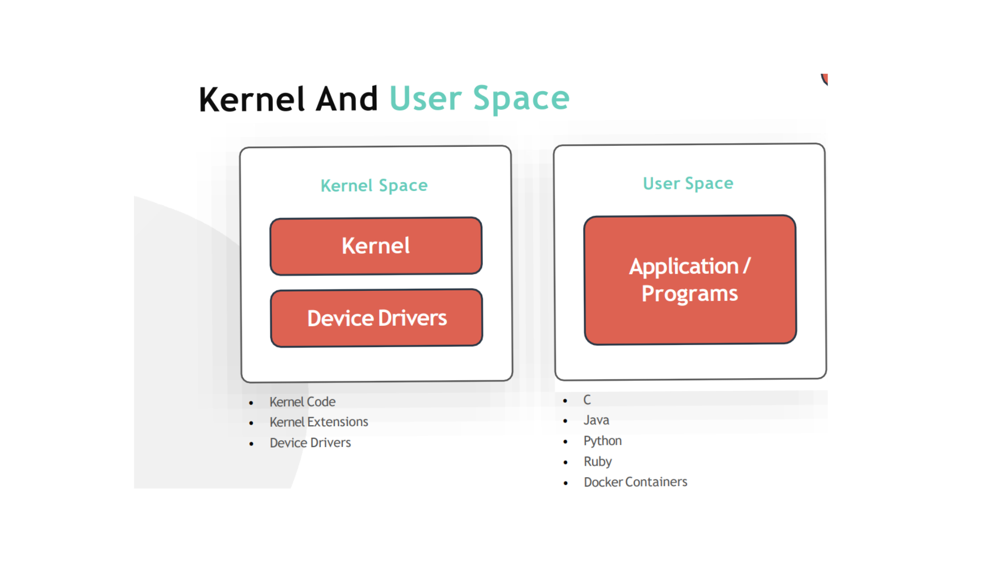
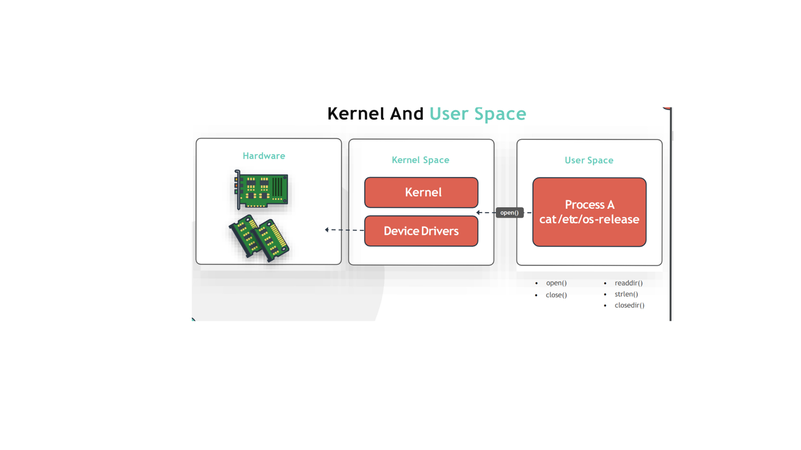

### Commands Overview:

| Command | Use |
| --- | --- |
| `dmesg` | Display system messages related to hardware and drivers from the kernel’s log |
| `udevadm` | udev administration tool for managing nodes in the `/dev` directory |
| `info` | To display information about a device |
| `--query=path` | Specify that you want to query the device path |
| `--name=/dev/sda5` | Specify the device for which you want to retrieve information |
| `udevadm info --query=path --name=/dev/sda5` | Retrieve device path information for the specified device |
| `udevadm monitor` | Listen to kernel and udev events, display real-time activity on your system in one line |
| `udev` | Device manager for kernel handling dynamic creation of device nodes in the `/dev` directory, managing device permissions, and processing device events in user space |
| `lspci` | List all peripheral connected devices (e.g. Network Card, Sound Card, Graphic Card, USB controller, and storage controller) |
| `lsblk` | Show a list of all storage devices like USB or HDD and how they are divided (into different folders or spaces) |
| `lscpu` | Display detailed information about CPU architecture, including CPU, cores, threads, etc. |

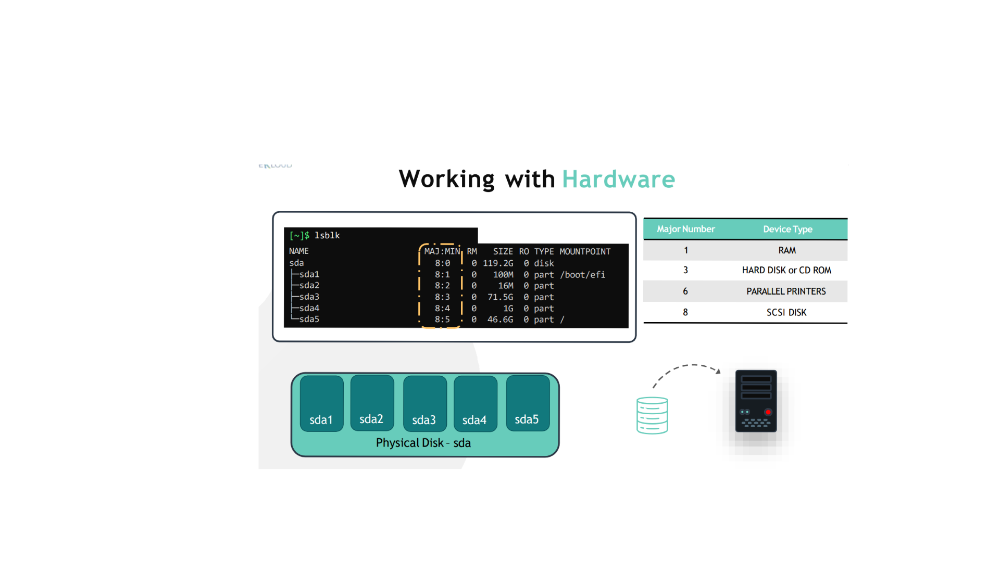

### Memory Commands Overview:

| Command | Use |
| --- | --- |
| `lsmem --summary` | Quick overview of system’s memory; shows total memory and how it is divided |
| `free -m` | Shows the amount of memory (RAM) free, used, and available on your system |
| `lshw` | Displays detailed information about your computer’s hardware including CPU, memory, storage, and network devices |

### Linux Boot Sequence:

Power ON → BIOS/POST (Check hardware and make sure everything is working) → Bootloader (It looks for bootloader in a storage device like GRUB) → Kernel (Bootloader loads Linux kernel in memory and starts it) → Init System (Kernel starts Init process and starts all background services and processes) → Services and Processes (Networking, display manager, and other essential services) → Login screen

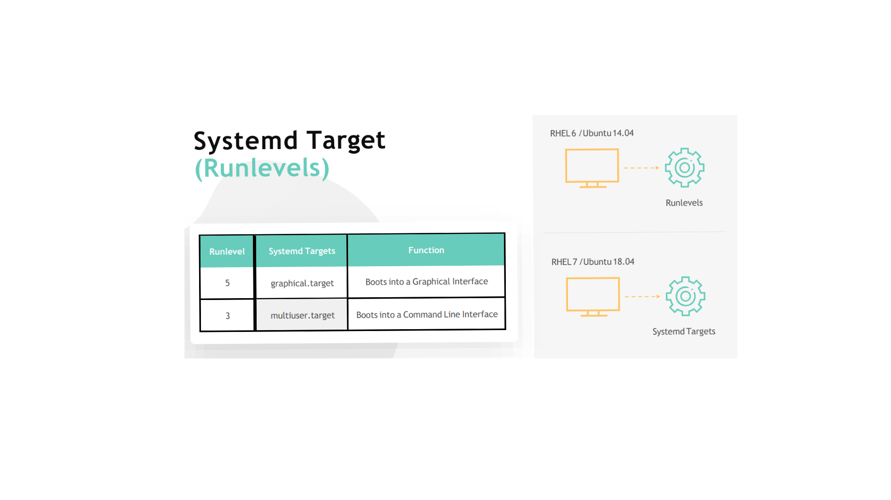
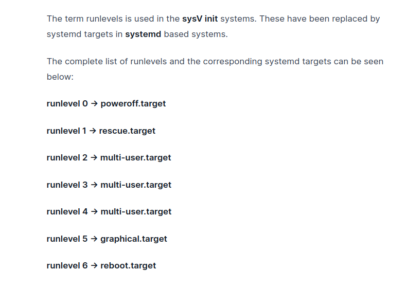
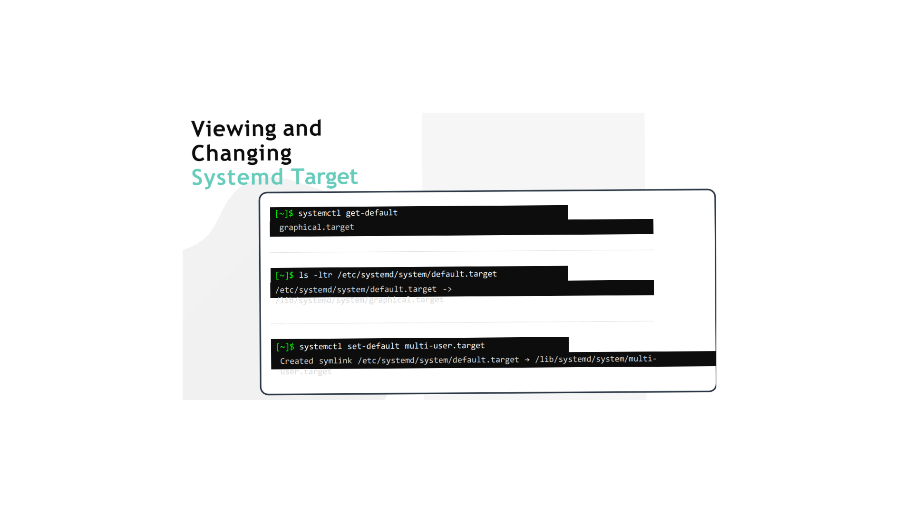
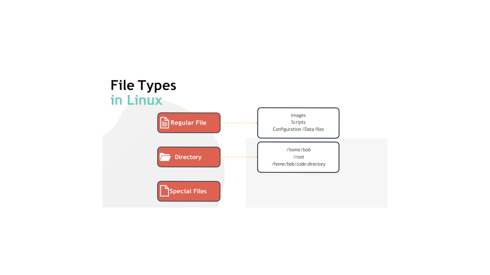
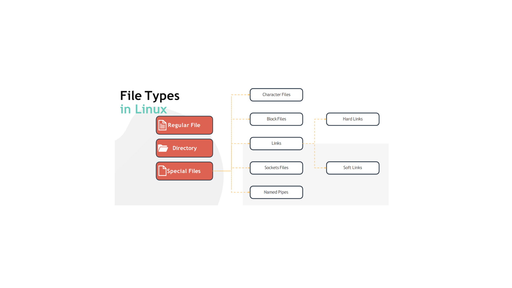
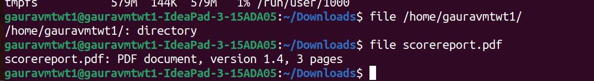
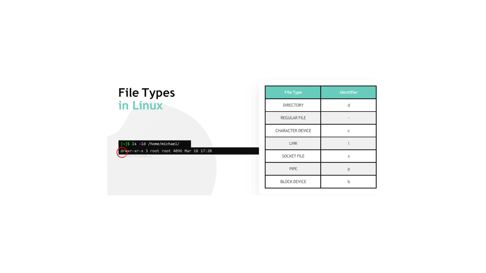

### File Types:

1. **Regular File ('-')**: Common files to store data like text, executables, images, etc.
   - Examples: `.txt` (text), `.sh` (script), `.out` (compiled output)
2. **Directory ('d')**: Special file that contains other files and directories, forming a hierarchy.
   - Example: `/home/username`
3. **Symbol Link ('l')**: A file that points to another file or directory. Similar to shortcuts in Windows.
4. **Character Device ('c')**: Represents a hardware device that transmits data character by character.
   - Example: `/dev/ttys0` (serial port), `/dev/console` (system console)
5. **Block Device ('b')**: Represents a device that transfers data in blocks, such as a storage device.
   - Example: `/dev/sda1`, `/dev/loop0`
6. **Socket ('s')**: Used for inter-process communication.
   - Example: `/var/run/docker.sock`
7. **FIFO (Named Pipe) ('p')**: Data written by one process can be read by another.

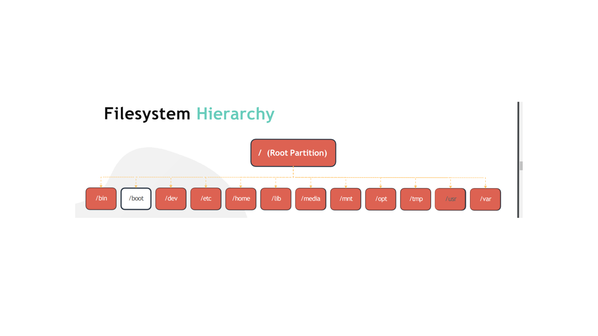

### File System Hierarchy:

- **/home**: Home directory for all users except the root user.
- **/opt**: Directory for installing third-party programs.
- **/mnt**: Directory to mount any file temporarily.
- **/tmp**: Temporary data storage directory.
- **/media**: External devices like USB connected here.
- **/bin**: Contains basic binaries like `cp`, `mv`, `mkdir`.
- **/etc**: Stores configuration files.
- **/lib** or **/lib64**: Directory for shared libraries.
- **/var**: Stores logs and cache data.
- **/usr**: Directory for user-related programs, libraries, and data.

| Command | Use |
| --- | --- |
| `df -hP` | Display mounted devices like keyboard or mouse |

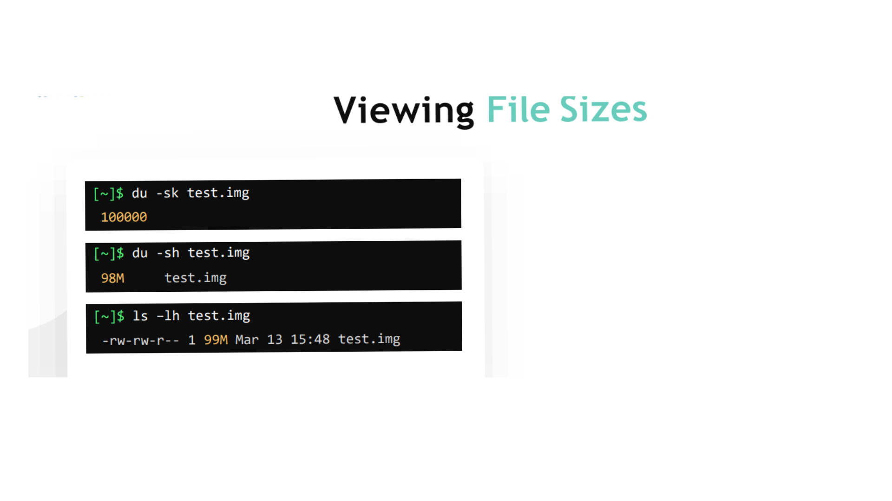

### Archiving Files:

- `tar -cvf test.tar file1 file2 file3`
  - `c`: Create a new archive
  - `f`: Specifies the file name of the archive to create
  - `v`: Verbose

- `tar -xf file_to_be_extracted.tar`
  - `x`: Extract from tar file

- `tar -zcf archive_name.tar.gz /path/to/directory_or_files`
  - Archive with gzip compression

- `gzip file1`: Compress a file
- `gunzip filename.gz`: Unzip a file

### Network and DNS Files:

- `/etc/hosts`: Maps hostnames to IP addresses; used for local hostname resolution before DNS queries.
- `/etc/resolv.conf`: Specifies the DNS server used for resolving domain names.
- `/etc/nsswitch.conf`: Configures the system databases and name service switch (NSS) for various services like hostname resolution, user authentication.

### DNS Record Types:

| **Record Type** | **Purpose** | **Example** | **Use Case** |
| --- | --- | --- | --- |
| **A** | Maps a domain to an IPv4 address | `example.com. IN A 93.184.216.34` | Directs `example.com` to an IPv4 address. |
| **AAAA** | Maps a domain to an IPv6 address | `example.com. IN AAAA 2606:2800:220:1:248:1893:25c8:1946` | Directs `example.com` to an IPv6 address. |
| **CNAME** | Maps an alias to the canonical domain name | `www.example.com. IN CNAME example.com.` | Redirects `www.example.com` to `example.com`. |
| **MX** | Specifies the mail server for a domain | `example.com. IN MX 10 mail.example.com.` | Directs emails for `@example.com` to `mail.example.com`. |
| **TXT** | Stores text information for various uses | `example.com. IN TXT "v=spf1 ip4:93.184.216.34 -all"` | Commonly used for SPF, DKIM, and other verifications. |
| **NS** | Specifies the authoritative DNS servers for a domain | `example.com. IN NS ns1.example.com.` | Indicates the DNS servers responsible for `example.com`. |
| **PTR** | Maps an IP address to a domain name (reverse DNS) | `34.216.184.93.in-addr.arpa. IN PTR example.com.` | Used in reverse DNS lookups to find the domain associated with an IP address. |
| **SRV** | Specifies information about services available for a domain | `_sip._tcp.example.com. IN SRV 10 60 5060 sipserver.example.com.` | Defines the location of servers for specific services like VoIP. |
| **SOA** | Contains administrative information about the domain | `example.com. IN SOA ns1.example.com. admin.example.com.` (... | Indicates the primary source of information for the domain, used in zone transfers. |
| **CAA** | Specifies which CAs can issue certificates for a domain | `example.com. IN CAA 0 issue "letsencrypt.org"` | Limits SSL/TLS certificate issuance to authorized Certificate Authorities. |
| **DNSSEC** | Provides authentication for DNS data | N/A | Secures DNS against attacks like cache poisoning and man-in-the-middle attacks using RRSIG, DNSKEY, etc. |

### Comparison of DNS Tools:

| **Feature** | **nslookup** | **dig** |
| --- | --- | --- |
| **Output** | Simple, less detailed | Detailed, comprehensive |
| **Ease of Use** | Easier for basic queries | More complex, but more powerful |
| **Record Type Query** | Basic (A records, reverse lookup) | Supports all DNS record types |
| **Customization** | Limited customization | Highly customizable with various options |
| **Interactivity** | Interactive mode available | Primarily non-interactive |
| **Installation** | Available on most systems by default | May require installation on some systems |

### When to Use:
- **nslookup**: Quick, basic DNS lookup without too much detail.
- **dig**: Detailed DNS information, advanced features like DNSSEC or tracing the resolution path.

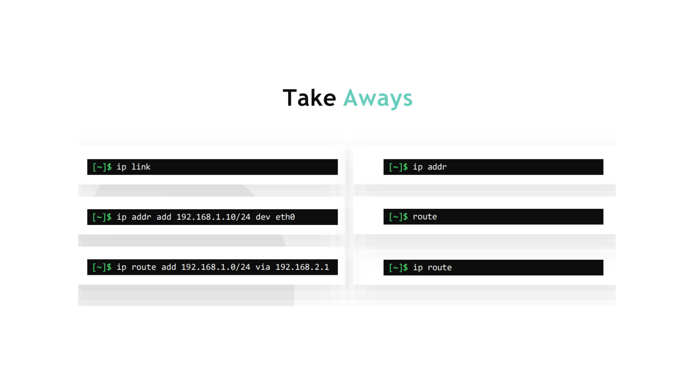

### Networking Tools:

- `traceroute`: A network diagnostic tool used to trace the path packets take from your system to a target destination. It shows each hop along the route.
  - Usage: `traceroute example.com`

- `mtr`: A combination of `ping` and `traceroute`. It continuously sends packets and provides live updates on the route taken to the destination, showing latency and packet loss for each hop.
  - Usage: `mtr example.com`

### System Log Files:

- `/var/log/messages`: General system log file containing messages from various system services.
- `/var/log/syslog`: A similar log file, found on some distributions, providing system-wide messages.
- `/var/log/secure`: Contains security-related messages, such as authentication attempts and failures.
- `/var/log/dmesg`: Captures kernel messages, particularly those generated during system startup.

### Disk Management Overview:

| Command | Use |
| --- | --- |
| `fdisk` | Manage disk partitions |
| `df` | Display disk usage |
| `du` | Show disk usage of files and directories |
| `lsblk` | List information about block devices |
| `blkid` | Identify block devices |
| `parted` | Manipulate partition tables |

### Partitioning and Disk Layout:

- **MBR (Master Boot Record)**: 
  - Can support up to 4 primary partitions or 3 primary and 1 extended partition.
  - Each primary partition can only be 2TB in size.
  - Used by older systems.

- **GPT (GUID Partition Table)**: 
  - Can support up to 128 partitions.
  - Each partition can be larger than 2TB.
  - Used by newer systems, supports UEFI.

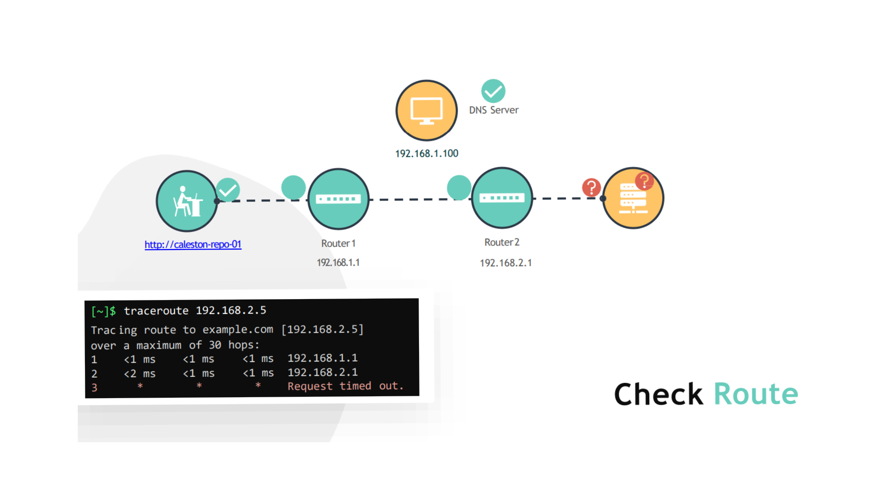

### File Systems Overview:

- **EXT2**: No journaling, suitable for USB drives and flash storage.
- **EXT3**: Adds journaling to EXT2, offering better recovery in case of power failures.
- **EXT4**: Improved performance and additional features like file system checksums, faster file access, and journaling.

### Advanced Storage Concepts:

1. **DAS (Direct Attached Storage)**: Storage that is directly attached to the server or workstation.
2. **NAS (Network Attached Storage)**: Dedicated file storage that is connected to a network, allowing multiple clients to access the storage over the network.
3. **SAN (Storage Area Network)**: High-speed network that provides block-level storage to servers. SAN storage appears as a local disk to the server.
4. **LVM (Logical Volume Manager)**: Provides more flexible management of disk space by creating logical volumes, which can span across multiple physical disks.

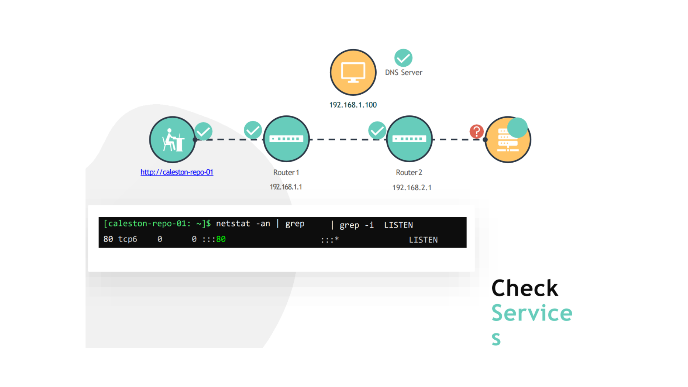

### Network Security Overview:

- **SELinux (Security-Enhanced Linux)**: Mandatory access control system built into the Linux kernel. It enforces security policies that restrict programs to limited access.
- **AppArmor**: Similar to SELinux but uses file paths instead of labels for enforcement. Easier to configure but less fine-grained.
- **iptables**: Firewall utility for controlling network traffic, used to define rules for packet filtering, NAT, and port redirection.
- **firewalld**: A dynamic firewall management tool with support for zones, making it easier to manage different trust levels for networks.

### Security Best Practices:

1. Use complex passwords and enable password expiration policies.
2. Disable unnecessary services to minimize attack surface.
3. Keep software and systems up-to-date with security patches.
4. Implement proper firewall rules to control incoming and outgoing traffic.
5. Enable auditing and monitoring of system activities to detect potential security breaches.

# Logical Volume Manager (LVM)

## 1. Concept of LVM:
- **Physical Volume (PV):** These are physical storage devices, e.g., Hard Disk, SSD.
- **Volume Groups (VG):** A collection of physical volumes, pooling them together into a single large storage space.
- **Logical Volume (LV):** These are created within Volume Groups and are used by the operating system to store data, similar to partitions but with more flexibility.

## 2. Why Use LVM:
- **Flexibility:** LVM allows resizing of volumes (both shrinking and expanding) without unmounting.
- **Snapshots:** LVM supports creating snapshots, which are important for backup and restoring from previous states.
- **Pooling Storage:**

| **Commands**                           | **Use**                        |
|----------------------------------------|---------------------------------|
| `pvcreate /dev/sdx`                    | Create Physical Volume          |
| `vgcreate myvg /dev/sdx`               | Create a Volume Group           |
| `lvcreate -L 20G -n mylv myvg`         | Create a Logical Volume         |
| `lvresize -L +10G /dev/myvg/mylv`      | Resize a Logical Volume         |

## 3. LVM Architecture:
- **Physical Extents (PE):** The smallest allocation unit in a volume group.
- **Logical Extents (LE):** These map directly to physical extents and form the logical volume.

## 4. Expanding/Reducing LVs:
- **Expanding:** You can extend a logical volume with free space in the volume group.
- **Reducing:** Reducing requires careful planning to avoid data loss.

## 5. Snapshots in LVM:
- Snapshots allow creating read-only or read-write copies of a logical volume at a specific point in time.

## 6. Mirroring and Stripping:
- **Mirroring:** LVM can mirror data across multiple disks for redundancy.
- **Stripping:** LVM can stripe data across multiple disks to increase performance.

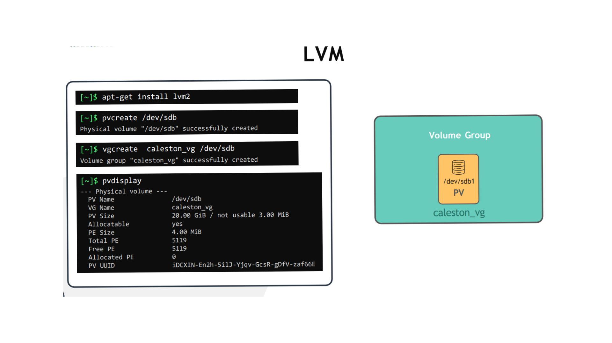
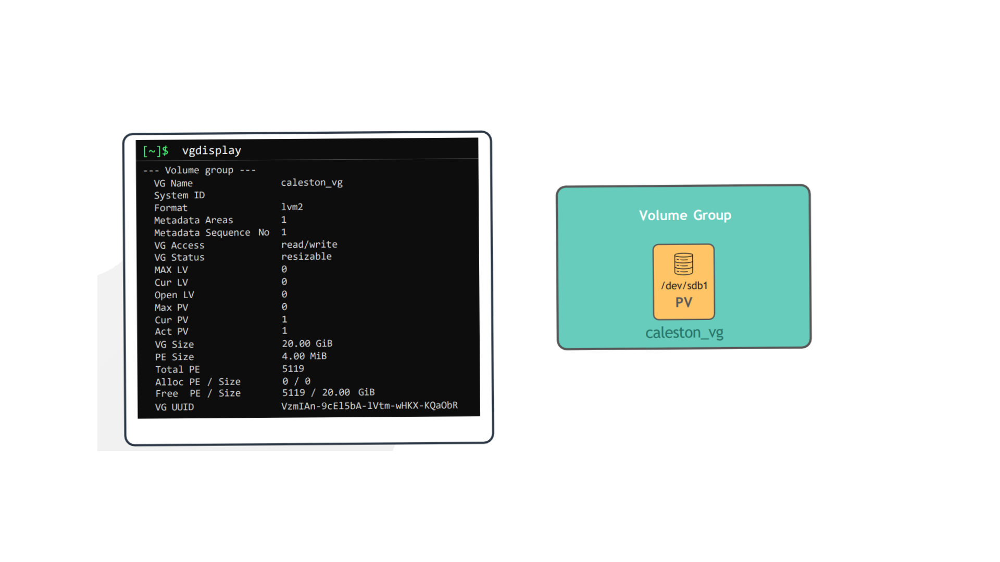
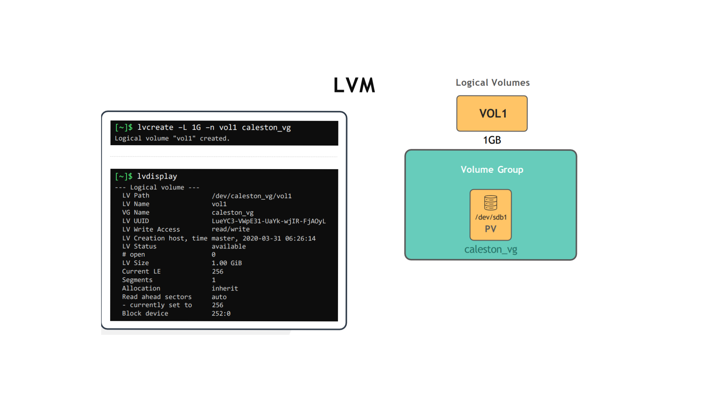
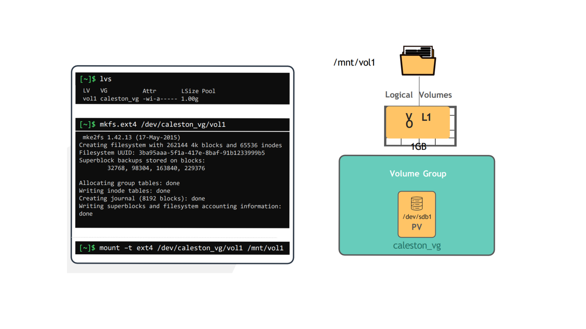
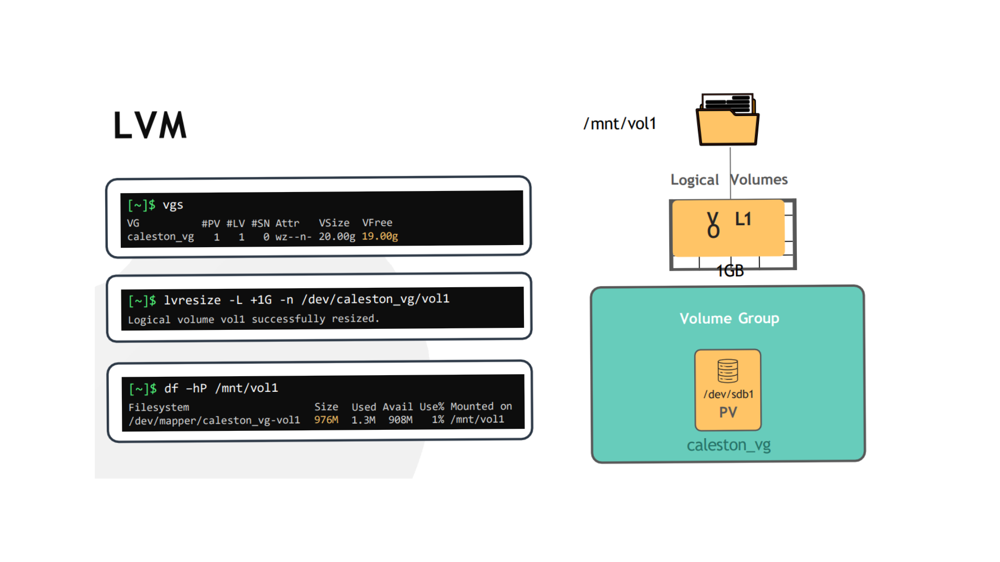
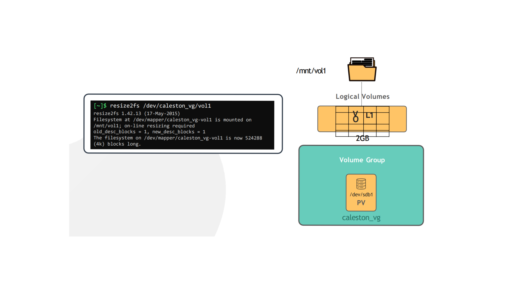
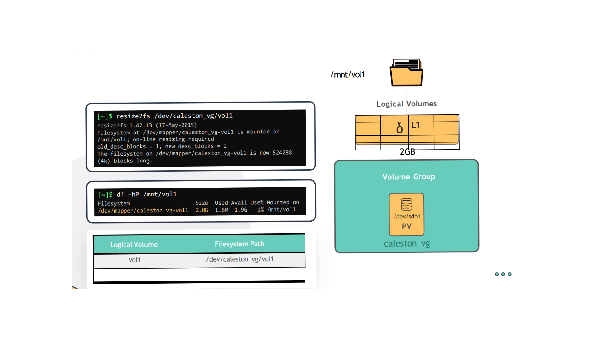

# SYSTEMD and Service Management

`systemd` is a service and service manager for the Linux operating system. It initializes the system during the boot process and manages services, ensuring they are started, stopped, and restarted as needed.

## Unit Files

Unit files are configuration files that `systemd` uses to manage services. These files describe how and when services are started.

### Common Unit Types

1. **`service`**: Defines a service.
2. **`target`**: Groups multiple units for synchronization.
3. **`socket`**: Activates services based on incoming sockets.
4. **`path`**: Activates services based on filesystem changes.

## Journald and Logging

`systemd` uses `journald` for logging. You can view logs using the following command:

```bash
sudo journalctl
```

## Service Configuration

Service unit files are located in `/etc/systemd/system/` or `/lib/systemd/system/`.

To edit a service configuration, use:

```bash
sudo systemctl edit [service name]

After making changes to a service, reload the systemd daemon to apply the changes:
```bash
sudo systemctl daemon-reload
```

Example: Creating a Custom Service
To create a custom service, follow these steps:

1. Create a new service unit file in /etc/systemd/system/.
2. Define [Unit], [Service], and [Install] sections with the appropriate configuration.
3. Enable and start the service using systemctl commands.

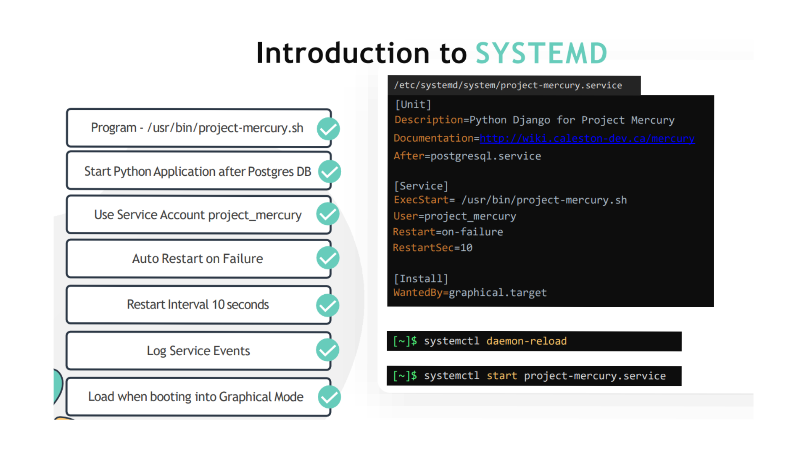
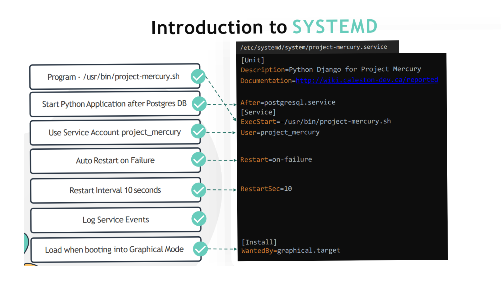


### Closing Note:

Linux provides a robust and secure environment for various applications, from servers to personal computers. Mastering Linux involves continuous learning and hands-on practice.

