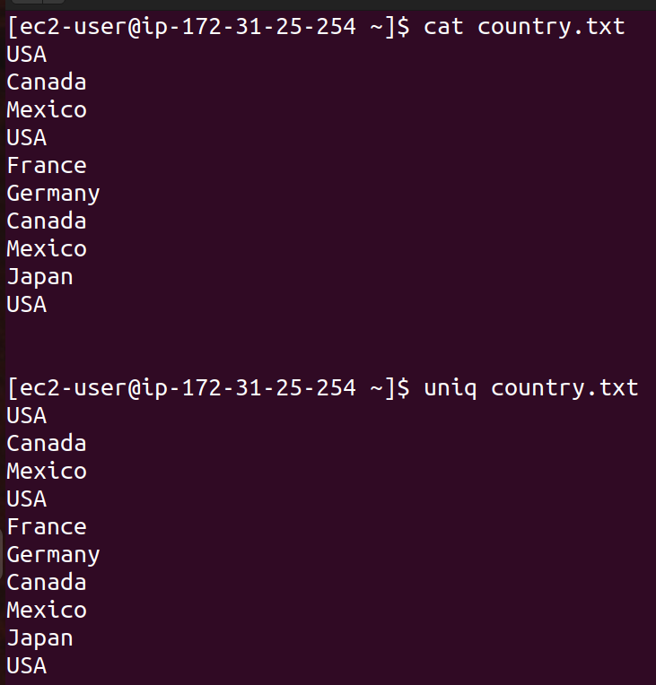
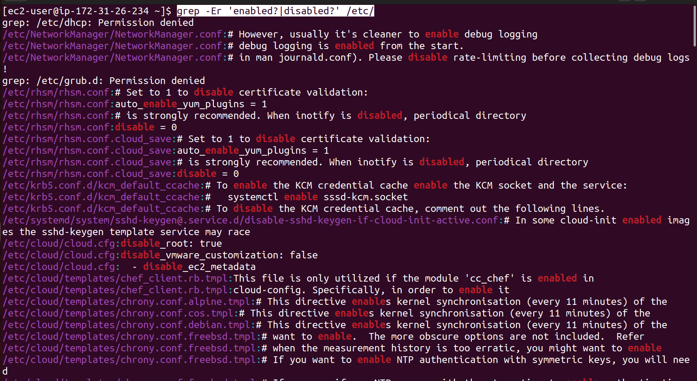
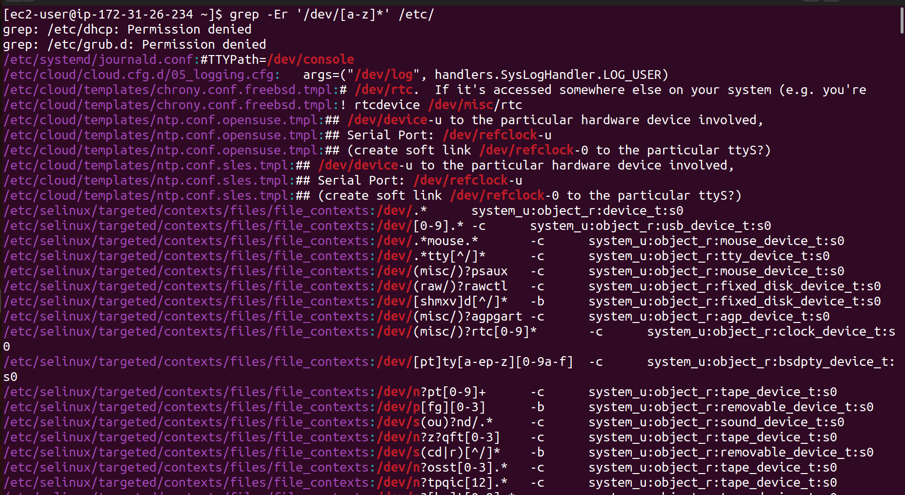

# Kodekloud RHCSA

- Login Method:
    1. Local text Mode Console: login  using local linux terminal
    2. Local graphical-mode console: login using Local GUI 
    3. Remote text-mode login: remotely accessing a linux device using terminal
    4. Remote graphical-mode login: remotely accessing a linux device using GUI
    

 

Console: low level text interface often accessed at boot up linux system, where you can login in and access command without GUI.

Virtual Terminal: Multiple text based console available within the system. You can switch between  these terminals using shortcut keys, even if you are in GUI environment.

Terminal Emulator: A software-based terminal running within a GUI, allowing you to interact with the shell in a graphical environment. ex- for windows : putty and linux: gnome terminal 

Virtual Network Computing(VNC): protocol for remote GUI access for linux

Remote Desktop Protocol(RDP) : protocol for remoe GUI access for windows.

ip command is rich and better version of ifconfig, route and netstat commands combined.

It is used for network management.

Basic syntax:  ip <object> <command>

object: address, link, route

command : add, del ,show

| Command | Use |
| --- | --- |
| ip link show | display information about network interface like status(up or down), MAC address |
| ip address show | show ip address assigned to network interfaces |
| ip address add | assign ip address to specific network interface |
| ip address del | remove ip address from specified network interface |
| ip link set | Enables(up) or Disables(down) network interfacei |
| ip route show | display route table, show how traffic routed from your system to another system. |
| ip route add | add a new route to routing table |
| ip route del | delete a route from routing table |

**Read and Use System Documentation:**

| <command> - -help | provide descriptive information about command |
| --- | --- |
| <command> -help(Not use much) | provide short information about command |
| man <command> | display full manual page of command |
| apropos <keyword> | if you are not sure what is the command, use apropos along with keyword , it will look up manpages and provide all possible outcome for that keyword |
| sudo mandb | update manpages database cache |
| systemctl | allows you to manage services, check system status , enable/disable services at boot, manage system state like reboot and shutdown |
| systemctl list-dependencies [unit] | list down all dependencies to run that service or unit |

**Working with files and directories:**

| ls | list |
| --- | --- |
| ls -a | list all including hidden file |
| ls -l | list directory content in long format |
| ls -h | list directory content in file size in human readable format |
| pwd | print working directory |
| cd / | go to root directory |
| cd -  | go to previous directory |
| cd  | go to home directory |
| touch | create a file |
| mkdir | create a directory |
| cp -r [source] [destination] | copy command recursively |
| mv [source] [destination] | move command |
| rm -r | remove recursively |

**Create and Manage Hard Link:**

inode(Index Node) : content metadata about file or directory, but not it names or content.

Example: library catalog:

- book title: file name
- catalog card : detail about book(author , ISBN, location ) is like inode

Metadata of inode:

1. File type 2. Permissions 3. Owner 4. Group 5. Size 6.Timestamps 7. Link Count 8. Pointers 

stat: file system status

Hard Link: A hard link is like creating a second name for the same file. Both the original file and hard link point to same data on disk.

| ln <path_to_target_file> <path_to_link_file> | Hard link |
| --- | --- |

Soft Link: A soft link is like a shortcut to another file or directory. It point’s to the file location rather than file itself.

**List, Set, and Change file Permission:**

| **Command** | **Use** |
| --- | --- |
| chgrp <options> <group><file/directory | change group of file or directory |
| chgrp -r <options> <group><file/directory | change group of file or directory recursivelyd |
| groups | display groups a current user is member of |
| chown | change ownership of file or directory |

| **Command** | **Use** |
| --- | --- |
| chmod | change permission of file or directory |
| u | user |
| g | group |
| o | other |
| r | read |
| w | write |
| x | execute |

**Search for files:**

| **Command** | **Use** |
| --- | --- |
| find | used to search for files or directories within a directory hierarchy based on name, type, size, etc. |
| find <path> <option> <expression> | syntax of find command |
| -name | name (option) of pattern what we are searching for |
| -size | size(option) of file what we are searching for |
| -mmin | minimum minutes(option): last time files or directory got modified |
| type -f | it represent looking for file only |
| type -d | it represent looking for directory only |
| -iname | search for files or directory by name but it is case insensitive |
| -o | or operator |
| **-not** / **\!** | negate a condition |
| -perm | permission |

**Compare and Manipulate File Content:**

| **Command** | **Use** |
| --- | --- |
| cat file_name.txt | used to concatenate and display content of file |
| cat -n  file_name.txt | display line number |
| cat file_name_1.txt  file_name_2.txt > combined.txt | concatenate multiple files |
| cat file_name.txt > output_1.txt | redirect the output |
| cat file_name.txt >> output_2.txt | appending a file |
| tac output_2.txt | show content in reverse |
| tail test_1.txt | display last 10 lines of a file |
| tail -n 20 test_1.txt | display last 20 lines of a file |
| tail -n 20 -f log_file.txt | This starts by showing the last 20 lines and then continues to follow the file as it grows. |
| tail -n 20 -F log_file_renamed.txt | The `-F` option is like `-f`, but it checks if the file is rotated (e.g., renamed or deleted) and then **continues real time monitoring** the new file. |
| head log_file.txt | display 10 lines of  beginning of file or stream of data |
| head -n 20 log_file.txt | display 20 lines from the beginning of a file or stream of data |
| head -c 50 log_file.txt | show first N bytes instead of line |
| sed [options] ‘command’ file_name | sed stand for stream editor and it is use for searching, finding, replacing, inserting, or deleting text/ |
| sed ‘s/old-text/new-text/’ sample_log.txt | replace first occurrence of “ old-text” with “new-text” in each line of “sample_log_txt” |
| sed’ s/old-text/new-text/g’ sample_log.txt | To replace all occurrences of a pattern in each line, add the `g` flag. Global substitution |
| sed -i ‘s/old-pattern/new-pattern/g’ sample_log.txt | **In-Place Editing:**To directly modify the file instead of just displaying the output, use the `-i` option. |
| sed -e ‘s/old_pattern_1/new_pattern_1/g’ ‘s/old_pattern_2/new_pattern_2/g’ log_file.txt | You can chain multiple commands using the `-e` option. |
| cut [option] file_name.txt | used to extract sections from each line of files or input based on delimiters , fields , byte positions or character positions |
| cut -b 1-4 file_1.txt | extract first four bytes from each line |
| cut -c 2-5 file_1.txt | extract characters from position 2 to 5 from each line |
| cut -d “:” -f 1 data.csv  | `-d ":"`: This sets the delimiter to `:`, meaning `cut` will treat the colon (`:`) as the field separator.                                                 -f 1: first column from each line  |
| uniq [file] | uniq only removes consecutive duplicates. To handle non-consecutive duplicates, you should sort the file first using the sort command before using uniq |
| sort file_1.txt | sort the lines in the file in ascending order (default behavior) |
| diff [option] file1 file 2 | command is used to compare content of file side by side. |
| diff -c file_1 file_2 | The `-c` option provides a context format, similar to unified but with more context lines around the changes. |
| diff –y file1 file2 | -y provides side by side comparision |

- Use `f` and `d` for structured text like CSVs or `/etc/passwd`.
- Use `c` or `b` when working with fixed-width data.

**Search files with Grep(Global Regular Expression Print):**

grep is used for searching text or pattern within files. 

Syntax: grep [option] pattern [file]

Common Options:

**-i:** ignore case(case-insensitive)

**-v:** invert match(return lines that do not match)

**-r:** Recursive search through directories

**-n:** Show line numbers

**-c:** Count the number of matching lines

**-w:** Match whole words only

**-l:** list the file names that contain the match

**-o:** option prints only the matching part of the line.

**-e:** option allows you to specify multiple patterns.

**Analyze Text With Regular Expressions(Regex):**

Regex are pattern used to match character combination in strings.

Type of Regex in Linux:

- 1) Basic Regular Expressions:
    - Used in command like grep(without -E), sed, etc.
    - Basic meta characters include ^, $, \ and more.
    
- 2) Extended Regular Expressions:
    - Used with commands like grep -E, sed -E, egrep etc.
    - Allows more complex patterns with additional meta characters such as +, ?, | , (), etc.

**Regex Operators:**

- **Caret(^)** : Matches the beginning of line.
- **Dollar($)** : Matches the end of line
- **Dot(.)** : Matches any single character except newline.
- **Asterisk(*)** : Matches zero or more occurrences of the preceding characters.
- **Plus(+)** : Matches one or more occurrences of the preceding characters(in ERE).
- **Question Mark (?)** : Matches zero or one occurrence of the preceding characters(in ERE).
- **Pipe(|)** : OR operator
- **Square Brackets ( [ ] )** : Matches any one of the characters inside the brackets.
- **Backslash ( \ )** : Escapes special characters.
- **Parenthesis ( () ) :** Group expressions
- **[ ^ ]** : It matches any character that **is not** inside the square brackets.

‘0+’ only look for only mentioned data in quotes but it will not find any 0 with sequence.

**Archive Files**

**tar (Tape Archive):** used to create and manage archives

tar [ option ] file.tar file1 file2 file2

**Commonly used options:**

**-c :** Create a new archive

**-x :** Extract files from archive

**-v :** Verbose mode

**-f :** Specify the name of archive

**-z :** Compress the archive using gzip

**-j :** Compress the archive using bzip2

**-t :** Lists the content of archive

**-r :** Append to existing file

**Compress and Decompress Files:**

| gzip file_1 file_2 file_3 | Compress file using the gzip compression algorithm |
| --- | --- |
| gzip -k filename | keep the original file after compression |
| gzip -d filename.gz | -d(decompress) a .gz file |
| bzip2 file_1 file_2 file_3 | Compress file using the bzip2 compression algorithm, which usually provide better compression than gzip |
| bzip2 -k file_1 file_2 file_3 | Keep the original file after compression |
| bzip2 -d  file_1 file_2 file_3 | -d(decompress) a .bz2 file |
| xz file_1 file_2 file_3 | Compression file using the xz compression algorithm, which provide better compression than bzip2 |
| xz -k filename | keep the original file after compression |
| xz -d filename | -d(decompress) a .xz file |
| gunzip filename.gz | decompress files that were compressed using gzip |
| bunzip2 filename.bz2 | decompress files that were compressed using bzip2 |
| unxz filname.xz | decompress file that were compressed using xz. |

	

	

	

	

	

