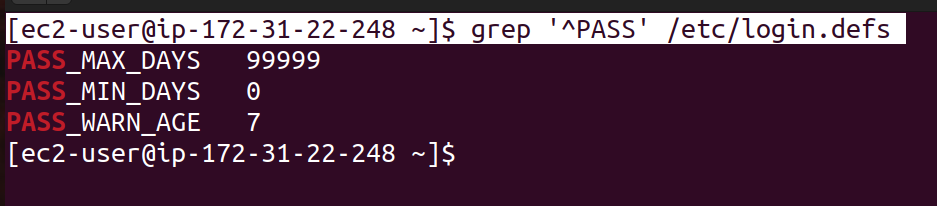
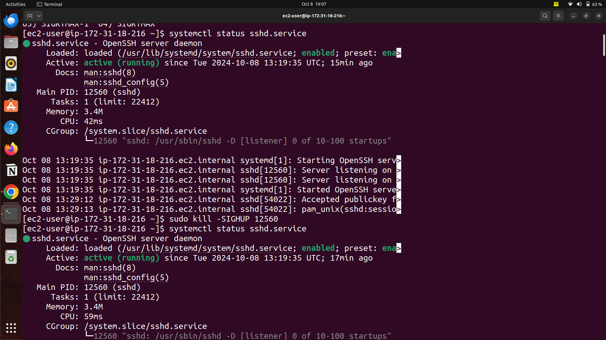
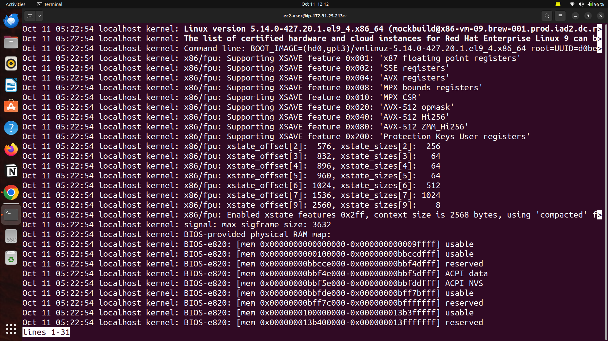
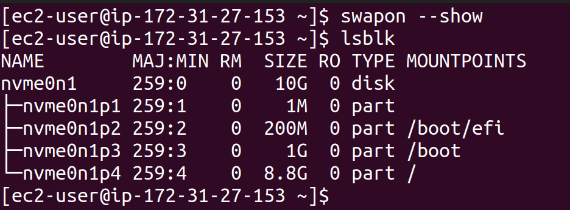
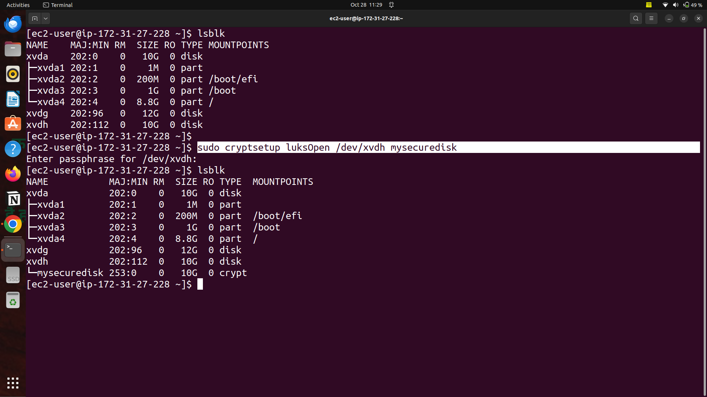
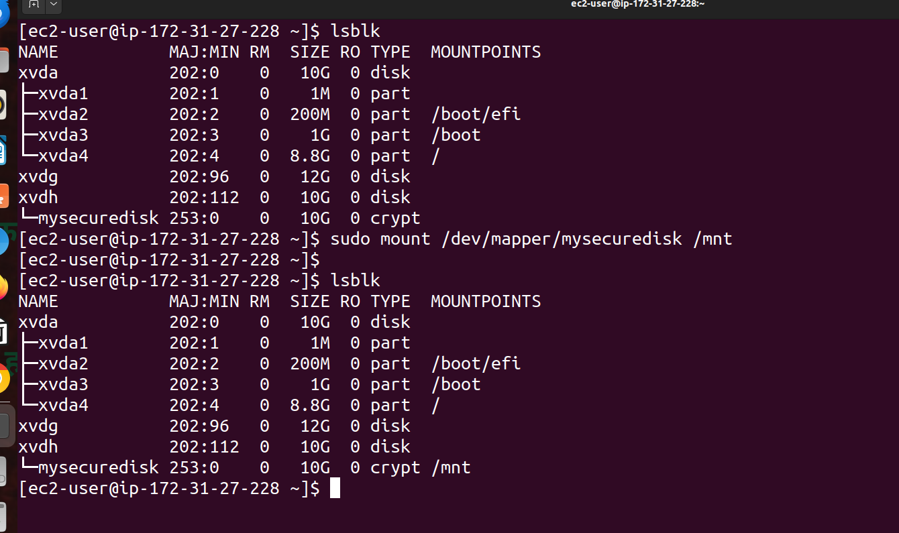
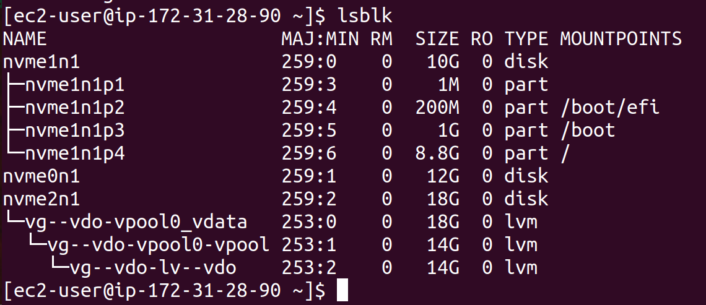

# Kodekloud RHCSA

- Login Method:
    1. Local text Mode Console: login  using local linux terminal
    2. Local graphical-mode console: login using Local GUI 
    3. Remote text-mode login: remotely accessing a linux device using terminal
    4. Remote graphical-mode login: remotely accessing a linux device using GUI
    


 

Console: low level text interface often accessed at boot up linux system, where you can login in and access command without GUI.

Virtual Terminal: Multiple text based console available within the system. You can switch between  these terminals using shortcut keys, even if you are in GUI environment.

Terminal Emulator: A software-based terminal running within a GUI, allowing you to interact with the shell in a graphical environment. ex- for windows : putty and linux: gnome terminal 


Virtual Network Computing(VNC): protocol for remote GUI access for linux

Remote Desktop Protocol(RDP) : protocol for remoe GUI access for windows.


ip command is rich and better version of ifconfig, route and netstat commands combined.

It is used for network management.

Basic syntax:  ip <object> <command>

object: address, link, route

command : add, del ,show

| Command | Use |
| --- | --- |
| ip link show | display information about network interface like status(up or down), MAC address |
| ip address show | show ip address assigned to network interfaces |
| ip address add | assign ip address to specific network interface |
| ip address del | remove ip address from specified network interface |
| ip link set | Enables(up) or Disables(down) network interfacei |
| ip route show | display route table, show how traffic routed from your system to another system. |
| ip route add | add a new route to routing table |
| ip route del | delete a route from routing table |

**Read and Use System Documentation:**

| <command> - -help | provide descriptive information about command |
| --- | --- |
| <command> -help(Not use much) | provide short information about command |
| man <command> | display full manual page of command |
| apropos <keyword> | if you are not sure what is the command, use apropos along with keyword , it will look up manpages and provide all possible outcome for that keyword |
| sudo mandb | update manpages database cache |
| systemctl | allows you to manage services, check system status , enable/disable services at boot, manage system state like reboot and shutdown |
| systemctl list-dependencies [unit] | list down all dependencies to run that service or unit |

**Working with files and directories:**

| ls | list |
| --- | --- |
| ls -a | list all including hidden file |
| ls -l | list directory content in long format |
| ls -h | list directory content in file size in human readable format |
| pwd | print working directory |
| cd / | go to root directory |
| cd -  | go to previous directory |
| cd  | go to home directory |
| touch | create a file |
| mkdir | create a directory |
| cp -r [source] [destination] | copy command recursively |
| mv [source] [destination] | move command |
| rm -r | remove recursively |

**Create and Manage Hard Link:**

inode(Index Node) : content metadata about file or directory, but not it names or content.

Example: library catalog:

- book title: file name
- catalog card : detail about book(author , ISBN, location ) is like inode

Metadata of inode:

1. File type 2. Permissions 3. Owner 4. Group 5. Size 6.Timestamps 7. Link Count 8. Pointers 


stat: file system status


Hard Link: A hard link is like creating a second name for the same file. Both the original file and hard link point to same data on disk.

| ln <path_to_target_file> <path_to_link_file> | Hard link |
| --- | --- |


Soft Link: A soft link is like a shortcut to another file or directory. It point’s to the file location rather than file itself.


**List, Set, and Change file Permission:**

| **Command** | **Use** |
| --- | --- |
| chgrp <options> <group><file/directory | change group of file or directory |
| chgrp -r <options> <group><file/directory | change group of file or directory recursivelyd |
| groups | display groups a current user is member of |
| chown | change ownership of file or directory |


| **Command** | **Use** |
| --- | --- |
| chmod | change permission of file or directory |
| u | user |
| g | group |
| o | other |
| r | read |
| w | write |
| x | execute |


**Search for files:**

| **Command** | **Use** |
| --- | --- |
| find | used to search for files or directories within a directory hierarchy based on name, type, size, etc. |
| find <path> <option> <expression> | syntax of find command |
| -name | name (option) of pattern what we are searching for |
| -size | size(option) of file what we are searching for |
| -mmin | minimum minutes(option): last time files or directory got modified |
| type -f | it represent looking for file only |
| type -d | it represent looking for directory only |
| -iname | search for files or directory by name but it is case insensitive |
| -o | or operator |
| **-not** / **\!** | negate a condition |
| -perm | permission |


**Compare and Manipulate File Content:**

| **Command** | **Use** |
| --- | --- |
| cat file_name.txt | used to concatenate and display content of file |
| cat -n  file_name.txt | display line number |
| cat file_name_1.txt  file_name_2.txt > combined.txt | concatenate multiple files |
| cat file_name.txt > output_1.txt | redirect the output |
| cat file_name.txt >> output_2.txt | appending a file |
| tac output_2.txt | show content in reverse |
| tail test_1.txt | display last 10 lines of a file |
| tail -n 20 test_1.txt | display last 20 lines of a file |
| tail -n 20 -f log_file.txt | This starts by showing the last 20 lines and then continues to follow the file as it grows. |
| tail -n 20 -F log_file_renamed.txt | The `-F` option is like `-f`, but it checks if the file is rotated (e.g., renamed or deleted) and then **continues real time monitoring** the new file. |
| head log_file.txt | display 10 lines of  beginning of file or stream of data |
| head -n 20 log_file.txt | display 20 lines from the beginning of a file or stream of data |
| head -c 50 log_file.txt | show first N bytes instead of line |
| sed [options] ‘command’ file_name | sed stand for stream editor and it is use for searching, finding, replacing, inserting, or deleting text/ |
| sed ‘s/old-text/new-text/’ sample_log.txt | replace first occurrence of “ old-text” with “new-text” in each line of “sample_log_txt” |
| sed’ s/old-text/new-text/g’ sample_log.txt | To replace all occurrences of a pattern in each line, add the `g` flag. Global substitution |
| sed -i ‘s/old-pattern/new-pattern/g’ sample_log.txt | **In-Place Editing:**To directly modify the file instead of just displaying the output, use the `-i` option. |
| sed -e ‘s/old_pattern_1/new_pattern_1/g’ ‘s/old_pattern_2/new_pattern_2/g’ log_file.txt | You can chain multiple commands using the `-e` option. |
| cut [option] file_name.txt | used to extract sections from each line of files or input based on delimiters , fields , byte positions or character positions |
| cut -b 1-4 file_1.txt | extract first four bytes from each line |
| cut -c 2-5 file_1.txt | extract characters from position 2 to 5 from each line |
| cut -d “:” -f 1 data.csv  | `-d ":"`: This sets the delimiter to `:`, meaning `cut` will treat the colon (`:`) as the field separator.                                                 -f 1: first column from each line  |
| uniq [file] | uniq only removes consecutive duplicates. To handle non-consecutive duplicates, you should sort the file first using the sort command before using uniq |
| sort file_1.txt | sort the lines in the file in ascending order (default behavior) |
| diff [option] file1 file 2 | command is used to compare content of file side by side. |
| diff -c file_1 file_2 | The `-c` option provides a context format, similar to unified but with more context lines around the changes. |
| diff –y file1 file2 | -y provides side by side comparision |

- Use `f` and `d` for structured text like CSVs or `/etc/passwd`.
- Use `c` or `b` when working with fixed-width data.


**Search files with Grep(Global Regular Expression Print):**

grep is used for searching text or pattern within files. 

Syntax: grep [option] pattern [file]

Common Options:

**-i:** ignore case(case-insensitive)

**-v:** invert match(return lines that do not match)

**-r:** Recursive search through directories

**-n:** Show line numbers

**-c:** Count the number of matching lines

**-w:** Match whole words only

**-l:** list the file names that contain the match

**-o:** option prints only the matching part of the line.

**-e:** option allows you to specify multiple patterns.


**Analyze Text With Regular Expressions(Regex):**

Regex are pattern used to match character combination in strings.

Type of Regex in Linux:

- 1) Basic Regular Expressions:
    - Used in command like grep(without -E), sed, etc.
    - Basic meta characters include ^, $, \ and more.
    
- 2) Extended Regular Expressions:
    - Used with commands like grep -E, sed -E, egrep etc.
    - Allows more complex patterns with additional meta characters such as +, ?, | , (), etc.

**Regex Operators:**

- **Caret(^)** : Matches the beginning of line.
- **Dollar($)** : Matches the end of line
- **Dot(.)** : Matches any single character except newline.
- **Asterisk(*)** : Matches zero or more occurrences of the preceding characters.
- **Plus(+)** : Matches one or more occurrences of the preceding characters(in ERE).
- **Question Mark (?)** : Matches zero or one occurrence of the preceding characters(in ERE).
- **Pipe(|)** : OR operator
- **Square Brackets ( [ ] )** : Matches any one of the characters inside the brackets.
- **Backslash ( \ )** : Escapes special characters.
- **Parenthesis ( () ) :** Group expressions
- **[ ^ ]** : It matches any character that **is not** inside the square brackets.





‘0+’ only look for only mentioned data in quotes but it will not find any 0 with sequence.


**Archive Files**

**tar (Tape Archive):** used to create and manage archives

tar [ option ] file.tar file1 file2 file2

**Commonly used options:**

**-c :** Create a new archive

**-x :** Extract files from archive

**-v :** Verbose mode

**-f :** Specify the name of archive

**-z :** Compress the archive using gzip

**-j :** Compress the archive using bzip2

**-t :** Lists the content of archive

**-r :** Append to existing file


**Compress and Decompress Files:**

| gzip file_1 file_2 file_3 | Compress file using the gzip compression algorithm |
| --- | --- |
| gzip -k filename | keep the original file after compression |
| gzip -d filename.gz | -d(decompress) a .gz file |
| bzip2 file_1 file_2 file_3 | Compress file using the bzip2 compression algorithm, which usually provide better compression than gzip |
| bzip2 -k file_1 file_2 file_3 | Keep the original file after compression |
| bzip2 -d  file_1 file_2 file_3 | -d(decompress) a .bz2 file |
| xz file_1 file_2 file_3 | Compression file using the xz compression algorithm, which provide better compression than bzip2 |
| xz -k filename | keep the original file after compression |
| xz -d filename | -d(decompress) a .xz file |
| gunzip filename.gz | decompress files that were compressed using gzip |
| bunzip2 filename.bz2 | decompress files that were compressed using bzip2 |
| unxz filname.xz | decompress file that were compressed using xz. |

	

	

	

	

	


| zip archive_name.zip file1.txt file2.txt | create a compressed .zip archive |
| --- | --- |
| zip -r archive_name.zip my_directory/ | compress an entire directory |
| unzip archive_name.zip | extract file from a .zip file |
| unzip archive_name.zip -d /path/to/directory | Extract to a specific directory |


**Redirecting Input and Output:**


| **>** | Output Redirection | Redirects output to a file, overwriting it |  |
| --- | --- | --- | --- |
| **>>** | Append Output Redirection | Redirects output to a file, appending to it |  |
| **<** | Input Redirection | Redirects input from a file to a command |  |
| **<<** | Here Document |  Redirects input to a command from a "here document," allowing multi-line input directly in the script or command |  |


**Archive, Compress, Pack and Unpack Files using Star:**

Star command is a powerful tool for archiving, compressing, packing and unpacking files.

**star [ option ] file=/path/to/archive.star files**

Common Star Option:

**-c** : Create a new archive

**-x**: Extract files from an archive

**-t**: List content of an archive

**-f**: Specify the file name of the archve

**-z**: Compress with gzip

**-bz**: Compress with bzip2

**-level**: Specify backup level(0 for full , 1 for incremental)

-**sparsh**: Handle sparsh files more efficiently ( A sparsh file is a type of file that contains large block of empty or null data, which are not physically stored on disk).


**Securely Transfer Files Between Systems:**

**scp** : secure copy

**stfp**: secure file transfer process

**Using scp (Secure Copy) :**

**Syntax:**

**Copy from a remote system to local system:**

```jsx
**scp -i /home/username/Downloads/PEMfile.pem username@remote_ip:/remote/path/to/file /local/path**
```


**Copy from a local system to remote system:**

```jsx
**scp -i /home/username/Downloads/PEMfile.pem /local/path/to/file username@remote_ip:/remote/path**
```


**Copy between two remote system:**

```jsx
**scp user1@remote_ip1:/path/to/file user2@remote_ip2:/path/to/file**
```

**Using sftp(SSH file transfer protocol):**

- sftp is an interactive, file transfer program, similar to FTP but using SSH encryption.
- It allows you to securely upload, download and manage files.

**Syntax:**

```jsx
**sftp -i /path/to/your-key.pem username@remote_ip**
```
Common Options:

- get -r : download a directory recursively
- put -r : Upload a directory recursively
- ls: list files and directories on the remote server
- cd: Change the directory on the remote server
- pwd: Print the current working directory on remote server
- lpwd: Print the current working directory on local server
- mget *.txt : Download multiple files
- mput *.log: Upload multiple files
- mkdir: Create a directory on the remote server
- rmdir: Remove a directory on the remote server
- rm: remove a file on the remote server


Upload a file from local to remote:


Upload a file from remote to local:


**Boot, Reboot, and Shutdown Systems:**

| **S.N.O** | **Command** | **Use** |
| --- | --- | --- |
| 1 | sudo systemctl reboot | reboot the system immediately |
| 2 | sudo systemctl poweroff | shutdown and poweroff the system |
| 3 | sudo systemctl reboot - -force | Forces a system to reboot, bypassing some checks |
| 4 | sudo systemctl poweroff - -force | Forces to power off, similar to cutting off the system |
| 5 | sudo systemctl reboot - -force - -force | More aggressive force reboot, equivalent to hardware reset |
| 6 | sudo systemctl poweroff - -force - -force | System to power-off aggressively, bypassing all services clearly |
| 7  | sudo shutdown 02:00 | Schedules a shutdown at 02:00 AM |
| 8 | sudo shutdown +15 | Schedule a shutdown in 15 minutes |
| 9 | sudo shutdown -r 02:00 | Schedule a system reboot at 02:00 AM |
| 10 | sudo shutdown -r +15 | Schedule a system reboot in 15 minutes |
| 11 | sudo shutdown -r +1 'Scheduled restart to do an offline-backup of our database’ | Schedules a reboot in 1 minute with a custom message to inform users about the reason for the restart.


**Diagnose and Manage the processes:**

ps command in linux used to display information about processes.

| Command/Flags | Use |
| --- | --- |
| ps  | list running process |
| ps aux | list detailed process information |
| a | All user’s process |
| u | Display the user that owns each process |
| x | Show processes without a controlling terminal(background processes) |

You will see columns like:

- USER: The owner of the process
- PID: Process ID
- %CPU: CPU usage
- %MEM: Memory usage
- COMMAND: The command that started the process


Show user friendly ps format:


**nice value** determines the **priority** of a process

### Key Points about Nice Values:

- **Range**: Nice values range from `20` (highest priority) to `19` (lowest priority).
- **Default**: The default nice value for processes is `0`.
- **Lower Nice Value**: Gives the process **higher priority** (it gets more CPU time).
- **Higher Nice Value**: Gives the process **lower priority** (it gets less CPU time).

### Summary:

- **Lower nice value** (e.g., `10`) = higher priority.
- **Higher nice value** (e.g., `10`) = lower priority.

ps lax: show detailed information about processes running on your system.


ps fax: show tree view of processes running on your system.


ps faux: display tree like structure of processes running on your system along with user.


renice: change the priority(nice value) of running processes.

sudo renice -n 7 pid


# Signals in Process Management(Sig stop and sig kill):

In process management, signals are used to communicate with processes and control their behavior.

## In summary:

- SIGSTOP pauses a process (it can be resumed)
- SIGKILL forcefully kills a process (it can't be resumed).

| **S.N.O** | **Command**          | **Use**                                                                                                   |
|-----------|----------------------|-----------------------------------------------------------------------------------------------------------|
| 1         | `kill -L`            | List all the available signal names that the `kill` command can send to processes.                         |
| 2         | `kill SIGHUP <process_id>` | Instruct a process to reload its configuration without restarting.                                        |
| 3         | `pgrep -a bash`       | Searches for all running processes with the name `bash` and displays both the process ID (PID) and the full command line used to start those processes. |
| 4         | `pkill -KILL bash`    | Immediately kills all processes named `bash`, including interactive shell sessions and any scripts running in `bash`. |





if you are running vim editor, press ctrl +z  then it will be exited

when press fg(foreground), it will come back on front from background


To put a task in background: Use command of that task to be put in background  with “&” symbol

using “jobs” command, we can see background command running


fg bring background or stopped to the foreground


bg [process id] resume a stopped job in background


lsof(list open file) are list of files that are currently open by processes.


**Locate and Analyze System Logs file:**

| S.N.O | Command                          | Use                                                                                                                    |
|-------|----------------------------------|------------------------------------------------------------------------------------------------------------------------|
| 1     | /var/log                         | Log file generated by system, services, application                                                                   |
| 2     | /var/log/syslog                  | System log for Debian/Ubuntu                                                                                           |
| 3     | /var/log/messages                | System log for RHEL/CentOS/Amazon Linux                                                                                |
| 4     | /var/log/auth.log                | Authentication log, successful and failed attempt; for Debian/Ubuntu                                                   |
| 5     | /var/log/secure                  | Security-related log such as login attempts and sudo usage; used in RHEL/CentOS/Amazon Linux                           |
| 6     | /var/log/dmesg                   | Hardware-related messages                                                                                              |
| 7     | /var/log/boot.log                | Logs from the system boot process                                                                                      |
| 8     | `/var/log/httpd/` or `/var/log/apache2/` | Logs for the Apache web server (depending on the distribution)                                   |
| 9     | /var/log/nginx/                  | Logs for the Nginx web server                                                                                          |
| 10    | /var/log/yum.log                 | Logs for the `yum` package manager (RHEL/CentOS systems) detailing package installations, updates, and removals        |
| 11    | /var/log/apt/                    | Logs related to the apt package manager (Debian/Ubuntu systems)                                                        |
| 12    | /var/log/cron                    | Logs related to cron jobs (scheduled tasks)                                                                            |
| 13    | /var/log/kern.log                | Kernel-related logs, especially hardware and driver-related issues (often found on **Debian/Ubuntu** systems)          |
| 14    | /var/log/journal/                | Logs managed by `systemd` (used on many modern Linux distributions)                                                    |
| 15    | /var/log/mail.*                  | Logs related to mail server activities                                                                                |
| 16    | `sudo grep -r 'ssh' /var/log`    | Searches for occurrences of the string "ssh" in all files within the `/var/log` directory recursively, displaying matches |
| 17    | `sudo less /var/log/secure`      | Allows you to view the contents of the `secure` log file, which contains security-related logs like SSH authentication attempts and sudo command usage |
| 18    | less /var/log/messages           | Opens the log file in a paginated view, allowing you to scroll through the logs to check system events, warnings, or errors |
| 20    | tail -F                          | Automatically detects if the file is moved, renamed, or recreated (as in log rotation) and continues to follow the new file |
| 21    | -F option                        | Ideal for monitoring log files that are subject to regular rotation or replacement, such as those in `/var/log`         |
| 22    | tail -F /var/log/secure          | **Follows the secure log file** in real-time                                                                          |


| S.N.O | Command                            | Use                                                                                                                                                                              |
|-------|------------------------------------|-----------------------------------------------------------------------------------------------------------------------------------------------------------------------------------|
| 1     | `journalctl`                       | Used to query and view logs collected by the **systemd journal**, which is responsible for collecting system logs. It provides a powerful and flexible way to inspect logs, including system boot messages, application logs, kernel messages, and more. |
| 2     | `sudo journalctl /usr/bin/sudo`    | Displays logs specifically related to the **`/usr/bin/sudo`** binary, showing all recorded `sudo` activities.                                                                    |
| 3     | `sudo journalctl -u sshd.service`  | Views logs related specifically to the **`sshd` service** (the OpenSSH server daemon). It shows all entries for the `sshd.service` unit, including service start, stop, authentication attempts, and connection details. |





**Common Option for Journalctl:**

| S.N.O | Command | Use |
|-------|---------|------|
| 1     | `journalctl -f` | Follow logs in real-time |
| 2     | `journalctl -b` | Show logs for the current boot |
| 3     | `journalctl -u sshd.service` | Show logs for a specific service |
| 4     | `journalctl --since=today` | Filter logs by time |
| 5     | `journalctl --since "2024-10-10 12:00" --until "2024-10-11 14:00"` | Filter logs between two dates |
| 6     | `journalctl -k` | Show kernel logs |
| 7     | `journalctl /usr/bin/sudo` | Show logs for a specific executable |
| 8     | `journalctl _UID=1000` | View logs for a specific user |
| 9     | `journalctl -n 20` | Limit the number of output lines |
| 10    | `journalctl -p err` | View priority-level logs |
| 11    | `journalctl -e` | Jump to the end of log |

### Priority Levels

- `emerg` (0): Emergency
- `alert` (1): Alert
- `crit` (2): Critical
- `err` (3): Error
- `warning` (4): Warning
- `notice` (5): Notice
- `info` (6): Informational
- `debug` (7): Debugging


The command `journalctl -p info -g '^b'` is used to shows logs of **info priority** (or higher) that start with the letter 'b'.


The command `journalctl -S 02:00` is used to display system logs starting from **2:00 AM** of the current day.


The command `journalctl -S 02:17 -U 02:28` is used to etrieves logs **from 2:17 AM to 2:28 AM** on the current day.


The command `journalctl -b 0` is used to display system logs from the **current boot**.


The error message **"no persistent journal was found"** indicates that your system does not have persistent logging enabled, meaning logs are cleared after a reboot.


To enable persistent logging:


After enabling persistent logging, `journalctl` will save logs to disk, and you should be able to retrieve logs from previous boots using `journalctl -b -1` (for the last boot).

The `last` command is used to display a list of the most recent logins and reboots on a Linux system. It reads from the `/var/log/wtmp` file, which stores login records.


The `lastlog` command is used to display information about the **most recent login** of all users on a Linux system. It reads from the `/var/log/lastlog` file, which stores information about the last login for each user.


# Manage Tuning Profiles:

Tuned is a system tuning tool that helps optimize system performance by dynamically adjusting various parameter based on the current workload.


| **S.N.O** | **Command** | **Use** |
| --- | --- | --- |
| 1 | `tuned-adm active` | To check the active **tuned** profile |
| 2 | `tuned-adm verify` | Checks whether the current system settings match the active **tuned** profile |
| 3 | `ls /usr/lib/tuned` | Lists the contents of the `/usr/lib/tuned` directory, which usually contains the available profiles and plugins for **tuned** |
| 4 | `ls /etc/tuned` | Lists the contents of the `/etc/tuned` directory, which typically contains custom configurations or overrides for **tuned** profiles |
| 5 | `tuned-adm list` | Displays a list of all available tuning profiles on your system |
| 6 | `sudo tuned-adm profile balanced` | General-purpose profile that provides a good compromise between performance and power saving. It's usually the default profile in many Linux distributions. |
| 7 | `sudo tuned-adm profile_info <profile_name>` | Specific tuning profile used by the `tuned` service, which optimizes system performance for various workloads |
| 8 | `sudo tuned-adm recommend` | Suggests the most suitable performance tuning profile based on your system's hardware and workload characteristics. |
| 9 | `sudo tuned-adm auto_profile` | Enables or disables the automatic selection of a tuning profile based on the system's characteristics and usage. When enabled, the `tuned` service dynamically adjusts the profile to match the system's current workload or hardware changes. |
| 10 | `sudo tuned-adm profile_mode` | Command that adjusts system performance based on predefined tuning profiles in Linux. It switches between performance modes like power-saving, throughput, or low-latency to optimize system resources for different workloads. |
| 11 | `sudo tuned-adm profile throughput-performance` | Applies the "throughput-performance" profile in Linux, which is optimized for maximum data throughput. This profile adjusts system settings like CPU frequency scaling and I/O scheduler to enhance performance for high-throughput workloads such as networking and disk operations. |
| 12 | Dynamic tuning | When enabled (`1`), allows the system to automatically adjust certain performance parameters based on current system load. Since it is set to `0`, the system will not dynamically adjust its performance settings, and will rely solely on the static profile you've set, such as `throughput-performance` or others you may configure. |


# List, Create, Delete,and Modify Physical Storage Partitions:
Added ebs volume to aws ec2 instance to perform fdisk and cfdisk.

lsblk: display block device information , their partitons and mountpoint


fdisk(Flexible Disk): to create MBR and GPT partition of disk using command line tool.

cfdisk(curses-based fdisk): user-friendly , interactive, menu driven partition tool that uses text based ui


n: new partition

w: write


After select yes then select quit


# Configure and Manage Swap Space:

## 1. Check existing Swap Space:

| **S.N.O** | **Command**  | **Use** |
| --- | --- | --- |
| 1 | swapon - -show | list active swap areas |
| 2 | lsblk | view block devices and their usage |



## 2. Create and Enable Swap on a Partition:

| **S.N.O** | **Command** | **Use** |
| --- | --- | --- |
| 1. | sudo mkswap /dev/vdb3 | Create  on partition |
| 2. | sudo swapon - -verbose /dev/vdb3 | Enable swap |
| 3. | sudo swapoff /dev/vdb3 | Disable swap |
| 4. | sudo dd if=/dev/zero of=/swap bs=1M count=2048 status=progress | Create a 2GB Swap File |
| 5. | sudo chmod 600 /swap | Set correct permission |


### Summary:

- You have a 2GB swap partition (`/dev/nvme1n1p1`) and a 2GB swap file (`/swap`) configured.
- Swap areas were managed and configured using `swapon`, `swapoff`, `mkswap`, and `dd` commands.
- You can prioritize swap areas by adjusting the `PRIO` value.

## **Manage and Configure LVM storage:**

LVM provides a flexible way to manage disk storage by allowing administrators to dynamically allocate, resize, and manage disk space without rebooting the system.

### 1. Understanding LVM Components:

- Physical Volume(PV) : The physical storage device, like a disk or partition, initialised for LVM use.
- Volume Group(VG) : A pool of storage that combines multiple physical volumes. Logical volumes are created from this pool.
- Logical Volume(LV) : A virtual partition from the volume group, which you can mount and use as a regular file system.

### 2. Creating and Configuring LVM

## 1. Creating a Physical Volume:


- Install local volume manger using lvm2 package.


## b. Creating a Volume Group(VG):


## c) Creating a Logical Volume:


## d) **Formatting and Mounting the Logical Volume:**

### 1. Format the LV:


### ii) Mount the LV:


### iii) Persist the Mount Point:  it to `/etc/fstab` to mount it automatically on boot


## 3. **Resizing Logical Volumes**

### i. Extend a Logical Volume:


### ii) Reduce a Logical Volume (Be Careful):

Step to reduce an XFS Logical Volume:

a. **Back Up Data: We have no data in logical volume**

```bash
sudo mkdir /backup
sudo rsync -a /mnt/my_lv/ /backup/

```
b. Unmount the LV:


c.  Remove the existing Logical Volume:


d) Recreate the Logical Volume with smaller size:


e) Format and Mount the New Logical Volume with XFS:


**f) Restore Data:**

```bash
sudo rsync -a /backup/ /mnt/my_lv/

```
### Commands used in LVM:


| Step No. | Task | Command | Description |
| --- | --- | --- | --- |
| **2** | **Creating and Configuring LVM** |  |  |
| a | Creating a Physical Volume (PV) | `sudo pvcreate /dev/sdb` | Initializes `/dev/sdb` as a physical volume for LVM. |
| b | Creating a Volume Group (VG) | `sudo vgcreate my_vg /dev/sdb` | Creates a volume group named `my_vg` using the `/dev/sdb` physical volume. |
| c | Creating a Logical Volume (LV) | `sudo lvcreate -L 10G -n my_lv my_vg` | Creates a 10GB logical volume named `my_lv` within the volume group `my_vg`. |
| d | Formatting and Mounting the LV | `sudo mkfs.xfs /dev/my_vg/my_lv` | Formats the logical volume with the XFS filesystem. |
|  |  | `sudo mkdir /mnt/my_lv` | Creates a directory to mount the logical volume. |
|  |  | `sudo mount /dev/my_vg/my_lv /mnt/my_lv` | Mounts the logical volume at `/mnt/my_lv`. |
|  | Persist the Mount Point | `/dev/my_vg/my_lv /mnt/my_lv xfs defaults 0 0` | Adds entry to `/etc/fstab` to mount automatically on boot. |
| **3** | **Resizing Logical Volumes** |  |  |
|  | Extend a Logical Volume | `sudo lvextend -L +5G /dev/my_vg/my_lv` | Increases LV size by 5GB. |
|  |  | `sudo resize2fs /dev/my_vg/my_lv` | Adjusts filesystem size (for ext4). |
|  |  | `sudo xfs_growfs /mnt/my_lv` | Adjusts filesystem size (for XFS). |
|  | Reduce a Logical Volume | `sudo umount /mnt/my_lv` | Unmounts the logical volume. |
|  |  | `sudo resize2fs /dev/my_vg/my_lv 5G` | Shrinks filesystem to 5GB (for ext4). |
|  |  | `sudo lvreduce -L 5G /dev/my_vg/my_lv` | Reduces the LV size to 5GB. |
|  |  | `sudo mount /dev/my_vg/my_lv /mnt/my_lv` | Mounts the LV again. |
| **4** | **Managing Volume Groups and Physical Volumes** |  |  |
|  | Extend Volume Group | `sudo pvcreate /dev/sdc` | Initializes a new physical volume `/dev/sdc`. |
|  |  | `sudo vgextend my_vg /dev/sdc` | Adds `/dev/sdc` to `my_vg`. |
|  | Remove Physical Volume | `sudo pvmove /dev/sdb` | Moves data off `/dev/sdb`. |
|  |  | `sudo vgreduce my_vg /dev/sdb` | Removes `/dev/sdb` from `my_vg`. |
|  |  | `sudo pvremove /dev/sdb` | Deletes the physical volume `/dev/sdb`. |
| **5** | **Useful Commands for Monitoring and Management** |  |  |
|  | View PVs, VGs, LVs | `sudo pvs` / `sudo vgs` / `sudo lvs` | Lists PVs, VGs, and LVs. |
|  | Detailed Information | `sudo pvdisplay /dev/sdb` | Shows detailed info for `/dev/sdb`. |
|  |  | `sudo vgdisplay my_vg` | Shows detailed info for `my_vg`. |
|  |  | `sudo lvdisplay /dev/my_vg/my_lv` | Shows detailed info for `my_lv`. |
|  | Removing LVM Components | `sudo lvremove /dev/my_vg/my_lv` | Deletes logical volume `my_lv`. |
|  |  | `sudo vgremove my_vg` | Deletes volume group `my_vg`. |
|  |  | `sudo pvremove /dev/sdb` | Deletes physical volume `/dev/sdb`. |

### Best Practices

- Always unmount logical volumes before resizing or deleting them.
- Backup important data before performing LVM operations, especially resizing and deletion.
- Use the `pvmove` command to safely migrate data from one physical volume to another within the same volume group.

## Create and Configure Encrypted Storage:

### 1. **Install cryptsetup** (if not already installed):


### 2. **Encrypt the Disk**:


### 3. **Format the Encrypted Disk**:



### 4. **Mount the Encrypted Disk**:



### 5. **Unmount and Close the Encrypted Disk**:


## Creating and Managing Raid(Redundant Array of Independent Disks) Devices

**RAID** is a way of storing data in different places(redundantly) on multiple hard disks to improve performance and data reliability.

**Array:** 

An array is a group of two or more combined disks to form a single storage unit . Data is spread across these disks based on the RAID configuration.

**RAID Level:**

A RAID Level defines how data is stored in the array. Every level(like RAID 0 , RAID 1 , RAID 5)  has a specific method of distributing and protecting data , balancing performance , storage capacity and redundancy.

**Parity:**

 Parity is a way to protect data by storing extra information. If one disk fails, the parity data helps recreate the lost data without needing all the original disks.

Here's a tabular comparison of the different RAID levels:

| **RAID Level** | **Minimum Disks Required** | **Purpose** | **Fault Tolerance** |
| --- | --- | --- | --- |
| RAID 0 | 2 | Increases performance (no redundancy) | None – failure of any disk results in data loss |
| RAID 1 | 2 | Mirroring for redundancy | 1 disk failure |
| RAID 5 | 3 | Balances redundancy and performance | 1 disk failure |
| RAID 6 | 4 | Double parity for enhanced redundancy | 2 disk failures |
| RAID 10 | 4 (must be even) | High performance and redundancy (RAID 1 + 0) | Multiple disks, as long as each mirrored pair has one working disk |

### 1. RAID Setup Requirement:
- Install the `mdadm` utility to create and manage RAID devices.


### 2. Creating a RAID Array:

#### a. RAID 1 Example (Mirrored Array):


#### b) Verify the RAID Array:


#### c)  **Formatting and Mounting the RAID Device**

- Format the RAID device with a filesystem (e.g., ext4):


- Create a mount point and mount the RAID device:


#### c) To make the RAID array mount at boot, add it to `/etc/fstab`:


#### d) Managing the RAID Array:

-  Stop the Raid Array(if needed)


#### e) **. Add/Remove Disks from RAID**:

- **Add** a new disk:
    
```bash
    sudo mdadm --manage /dev/md0 --add /dev/sdd
```
    
- **Remove** a disk:
    
```bash
    sudo mdadm --manage /dev/md0 --fail /dev/sdb
    sudo mdadm --manage /dev/md0 --remove /dev/sdb
    
```

#### f) **Monitoring and Maintaining RAID**

- **Check RAID Status**:
    
```bash
    cat /proc/mdstat
```
    
- **Send Email Alerts** (configure in `/etc/mdadm/mdadm.conf`):
    
```bash
    sudo mdadm --monitor --scan --mail=user@example.com --delay=300 --syslog
```
    
- **Assemble RAID on Reboot** (ensure it’s configured in `/etc/mdadm/mdadm.conf`):
    
```bash
    sudo mdadm --detail --scan | sudo tee -a /etc/mdadm/mdadm.conf
```
### **Best Practices**

- Always back up data before making changes.
- Monitor RAID status regularly.
- Use a UPS to prevent data corruption in case of power failure.

RAID offers robust data protection but does not replace regular backups, as it primarily ensures data availability and redundancy.

## Create, Manage and Diagnose Advanced Filesystem Permissions:

### Access Control Lists:

ACL allows you to set permissions for individual users or groups beyond just the owner, group and others.

**Key ACL Concepts:**

1. ACL Types
    - Access ACL: Set permissions on files and directories for users and groups.
    - Default ACL: Set default permissions for new files/directories created within a directory.
2.  Basic Permissions: Like standard permissions, ACLs use read(r), write(w), and execute(x) permissions.


ACL Commands:

#### a.  Set ACL:

```bash
setfacl -m u:username:permissions filesname
```


+mark indicates it is an acl

#### b. **View ACL**:


mask is maximum permission allowed that can be granted to user.

Modify Mask:


The term **effective** in ACLs represents the actual permissions that are applied to a user or group after the **mask** is taken into account.

### Set ACL for a Group


### Remove ACL permission for user:


### Change Recurssively:


### Append Attribute to a file:


### list attribute for a file:


## **User and Group Disk Quotas For Filesystem:**

Limiting disk usage per user and group on a specified filesystem.

### 1. Install Quota Package:


### 2. Edit /etc/fstab:


### 3. **Reboot the System**:


### 4. **Initialize Quota Files**:

**Enable User and Group Quotas**:


**Verify Quotas with `report`**:


**Set User Quota**:

1.


2.


- Edit the quota to specify soft and hard limits for ec2-user on `/dev/nvme2n1`.

**Check User Quota**:


- Soft and hard limits control how much disk space the user can use (soft limit with grace period, hard limit as an absolute max).

**Test Quota Limits**:

- Create files to test quota limit:


- Check current quotas:


### Create and Configure File Systems:

mkfs.xfs : XFS Filesystem

mkfs.ext4: ext4 Filesystem

1. Creating an XFS File System:


2. Creating an EXT4 File System:


### Remove File System:

a) XFS:


b) ext4:


### 1. Various flags for XFS and EXT4 file system:

a) Create Label for disk using XFS:


b) Display current label for XFS:


c) Change Label of XFS:


d) Create Label and inode for ext4:


e) Change Label for ext4:


f) Man Page of ext4 and xfs:


## **Create, Mount, and use vfat File Systems:**

vfat32: Virtual File Allocation Table

### 1. Create a `vfat` File System :

Step 1: Identify the Disk/Partition


Step 2: Create the `vfat` File System:

Created one partition on 10G using fdisk


- Use `n` to create a new partition.
- Press `t` to change the partition type, then enter `b` for W95 FAT32.

`F 32` specifies FAT32, which supports larger file systems (up to 16TB with 4096-byte sector size).

- **Choosing the Right FAT Type**:
    - Use **FAT16** for volumes up to 2GB.
    - Use **FAT32** for volumes larger than 2GB.
### 2. Mount the `vfat` File System:

Step 1: Create a Mount Point:


Step 2: Mount the File System:


### **3. Persistent Mount via /etc/fstab**:


Add the following line to automatically mount at boot:


### 4. **Unmount the File System**:


### 5. Integrity Checks for vfat File Systems:

Step1: **Check File System Integrity**:

Use dosfsck to check for errors:


## Configure Systems to Mount File systems At or During Boot:

## Step-by-Step Guide

### 1. **Create a Mount Point (if not existing):**

```jsx
sudo mkdir /mybackups
```

### 2. **Mount the Filesystem Temporarily (to verify):**

```bash
sudo mount /dev/vdb1 /mnt/
sudo touch /mnt/testfile
ls -l /mnt/
sudo umount /mnt/
```
### 3. **Edit `/etc/fstab` to Add Filesystem Entries:**
Open the `/etc/fstab` file with a text editor:
    
```bash
sudo vim /etc/fstab
```
Add entries similar to the following, adjusting for device names, mount points, and filesystem types:

```bash
/dev/vdb1 /mybackups xfs defaults 0 2
/dev/vdb2 /mybackups ext4 defaults 0 2

```
Alternatively, you can use the UUID instead of device names for more reliability:

```bash
UUID=9ab8cfa5-2813-4b70-ada0-7abd0ad9d289 /mybackups xfs defaults 0 0
```
- **`0` (Fifth Field)**: This filesystem will not be included in the backup routine.
- **`2` (Sixth Field)**: `fsck` will check this filesystem after checking the root filesystem.

### Field 6: Filesystem Check Order

The sixth field determines the order in which `fsck` (filesystem check) runs during boot to check the integrity of the filesystem. The `fsck` command is used to detect and fix filesystem errors.

- **Value of `0`**: Do not check the filesystem at boot.
- **Value of `1`**: Check this filesystem first (used for critical filesystems like root `/`).
- **Value of `2`**: Check this filesystem after the root filesystem (used for non-root filesystems).
    
### **4. Reload `systemd` Daemon (if on a `systemd`based system):**

```bash
sudo systemctl daemon-reload
```

- **Test the Configuration:**
    - Reboot the system to check if the mount persists:
```bash
sudo systemctl reboot
```

- After rebooting, verify that the filesystem is mounted:

```bash
lsblk
ls -l /mybackups/
```
## **Configure Disk Compression:(VDO service was part of RHEL8, to use VDO it come under lvm in RHEL9)**

**Virtual Data Optimizer (VDO)** is a tool designed to optimize storage through feature like deduplication, compression and zero block filtering.
          
**Deduplication:** removing duplicate copies of repeating  data to save space.

**Compression:** Reducing the size of data by encoding it in more efficient format to save storage space.

**Zero-block Filtering**: Eliminating block of filtering data that are entirely filled with zeros to reduce storage overhead.

Prerequisite: lvm2 installed already.

To set up VDO (Virtual Data Optimizer) using LVM on RHEL 9, follow these steps:

### **Step 1: Create Physical Volume (PV)**:


### Step 2: Create Volume Group (VG):


### Step 3: Create Logical Volume (LV) with VDO

Create the logical volume with the `--type vdo` flag.


### Step 4: Format and Mount the VDO Volume

- Format the created VDO volume (e.g., `/dev/vg-vdo/lv-vdo`)




#### 2. Create a mount point and mount the volume.


### Step 5: Configure Auto-Mount on Boot

- 1. Get the UUID of the VDO volume.


- 2. Add an entry to `/etc/fstab` to ensure the volume is mounted automatically on boot:


### Summary of Commands:

- sudo pvcreate /dev/nvme2n1
- sudo vgcreate vg-vdo /dev/nvme2n1
- sudo lvcreate --type vdo -n lv-vdo -l 100%FREE /dev/vg-vdo
- sudo mkfs.xfs /dev/vg-vdo/lv-vdo
- sudo mkdir /mnt/vdo
- sudo mount /dev/vg-vdo/lv-vdo /mnt/vdo
- sudo blkid /dev/vg-vdo/lv-vdo

## Manage Layered Storage Using Stratis:

**Managed Layered Storage** simplifies storage management by creating a virtualized storage layer over physical devices.

**Stratis** a storage management tool focusing on managing and deploying layered structure with features like snapshot, thin provisioning , and tiering.

**Snapshot:** Snapshot capture the current state of a filesystem, allowing you to revert to it later if needed, useful for backup and recovery.

**Thin Provisioning:** Thin Provisioning allocates storage on demand, optimizing space by only using capacity as data is written, rather than pre-allocationg all storage.

**Tiering:** Tiering automatically moves data between faster and slower storage based on usage, balancing performance, cost by storing frequently accessed data on faster disks. 

### 1. Installing Stratis:


### 2.  **Creating a Stratis Pool**:

Create a pool with one or multiple devices:


List pool details:


### 3. **Creating a Filesystem**:

Create a file system in the pool:


- View filesystem details:


### 4. **Mounting the Filesystem**:

- a. **Create a Mount Directory**:


- b. **Edit the `/etc/fstab` File**:

  - To ensure the filesystem mounts automatically on boot, add an entry to `/etc/fstab`.
  - Open `/etc/fstab` in a text editor, such as `vi` or `nano`.


- c. **Verify the Mount**:


- d. **Copy Data to /mnt/mystratis:**:


## **Adding Storage Devices To the Stratis Pool:**

```bash
sudo stratis pool add-data my-pool /dev/vdd
```

## **Filesystem Snapshots With Stratis**:

### 1. **Create a Snapshot**:


### 2. **Verify the Snapshot**:


### 3. Delete a File:


### 4. **Rename Filesystems to Restore from Snapshot**:


This renames the original filesystem (`mys1`) to `mys1-old` and renames the snapshot (`mys1-snapshot`) back to `myfs1`, effectively restoring the snapshot.

### 5. **Remount the Filesystem**:


After unmounting and remounting, the filesystem is now restored to the snapshot state.

## Schedule Tasks To Run At a Set Time

### 1. Cron Job:
- Cron Job are scheduled in the /etc/crontab file or by using the crontab -e command.


```bash
* : Every Possible Value for that time limit.

Specifiers:
, : list specific times(e.g, 15,45 runs at 15 and 45 mins.
- : create a range( e.g. , 2-4 runs from 2 to 4 )
*/n: denotes steps (e.g., */4 runs every 4 hours.
```
- System-wide cron schedules are stored in `/etc/cron.hourly`, `/etc/cron.daily`, `/etc/cron.weekly`, and `/etc/cron.monthly`.


### a. Use sudo vi /etc/crontab:


