# Shell Script Basics

## 1. What is a Shell Script?

A shell script is a file containing a series of commands that are executed by the shell (the command-line interpreter). It automates repetitive tasks, configures environments, or executes multiple commands in a specific order without user interaction.

## 2. Step-by-Step Process to Create a Shell Script

### Step 1: Plan the Script
Before writing a shell script, it is important to have a clear understanding of what you want the script to achieve. Write down the steps and the associated commands needed to complete the task.

### Step 2: Create the Script File
- Use a text editor to create a new file (e.g., `print_hello_world.sh`).
- Add the shell commands you need in the file in the order you want them executed.

### Step 3: Add Commands to the Script
Add the series of commands inside the script that were executed in the last lab or your planned task.

Example:
```bash
#!/bin/bash
echo "Hello World..."
# Add additional commands as needed
```

### Step 4: Make the Script Executable
To execute the script, you can either run it using the `bash` command or configure it to run as an executable file.

#### Option 1: Execute using `bash`
Run the script directly using:
```bash
bash print_hello_world.sh
```

#### Option 2: Make it Executable
Remove the `.sh` extension and configure the script to run like a system command. Use the following command to make the script executable:
```bash
chmod +x print_hello_world
```

### Step 5: Handle Command Not Found Error
If you try to run the script and see a "command not found" error, it means the OS can't find the script in the system’s PATH environment variable.

### Step 6: Add the Script to PATH
To resolve the error, append the directory containing your script to the PATH variable:

```bash
export PATH=$PATH:/path/to/your/script
```

This allows you to run the script from any location as a normal command.

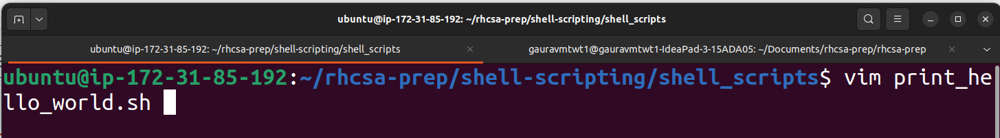
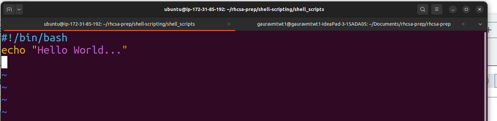
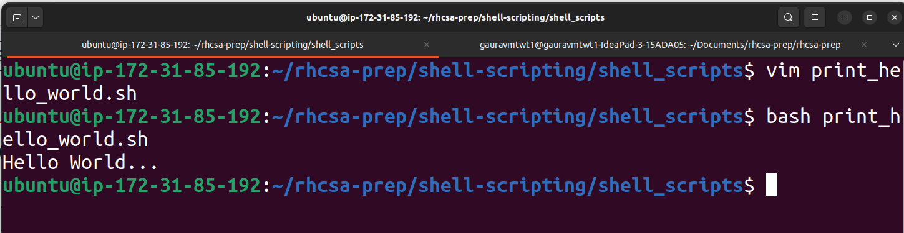
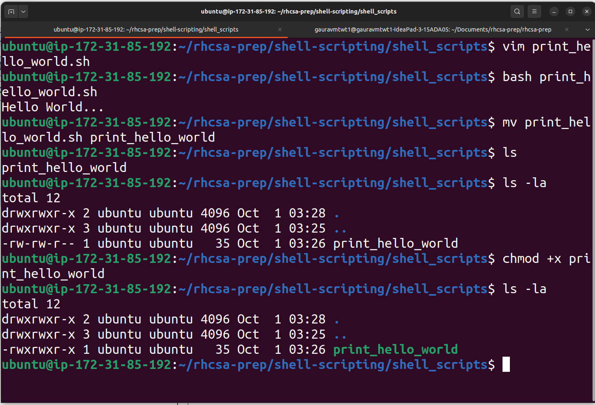
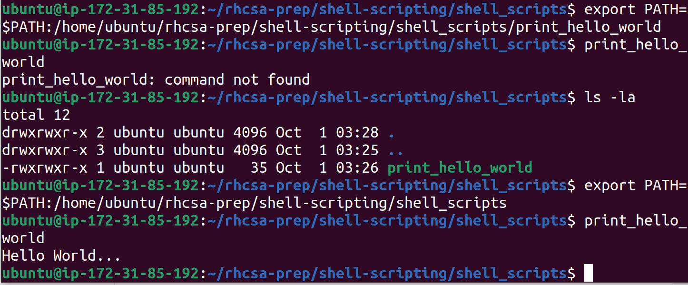


# Shell Script Basics: Variables and Static Values

## 1. What is a Variable in Shell Script?

A variable in a shell script is a placeholder or a symbolic name that holds a value, which can be used and modified during the script execution. Variables help to store data, such as strings, numbers, or filenames, which can be reused multiple times throughout the script.

### Example:

```bash
#!/bin/bash
# Defining a variable
greeting="Hello, World!"

# Using the variable
echo $greeting
```

In this example, the variable `greeting` stores the string "Hello, World!" and is accessed using `$greeting`.

## 2. How Do You Differentiate a Static Value from a Variable?

A **static value** (also called a literal or constant) is a fixed value that does not change during the execution of the script, while a **variable** can hold different values and can be changed as needed.

### Example:

```bash
#!/bin/bash

# Static value
echo "Hello, World!"

# Using a variable
greeting="Hello, World!"
echo $greeting
```

In this example:
- `"Hello, World!"` is a static value. It is directly printed without using any variable.
- `greeting` is a variable that stores the same string, but it allows you to change the value if needed later in the script.

# Best Practices for Variable Names in Shell Scripting

In shell scripting, it is important to follow naming conventions to improve the readability and maintainability of the code. Here are some best practices:

## Good Practice
- Use lowercase letters for variable names.
- Separate words with underscores (`_`) to improve readability.

### Example:
```sh
mission_name="Apollo"
```

## Bad Practice
- **Avoid** using capital letters for variable names.
- **Avoid** using spaces in variable names.
- **Avoid** using hyphens (`-`) in variable names as they can be confused with subtraction operators.

### Bad Examples:
```sh
Mission_Name="Apollo"
Mission Name="Apollo"  # Error due to space
Mission-name="Apollo"  # Error due to hyphen
```

## Additional Recommendations:
- Use descriptive names that make the purpose of the variable clear.
- Avoid using single-letter variables unless in very small loops or temporary cases.
- For constants (values that do not change), uppercase variable names are acceptable by convention:
  
  ```sh
  MAX_LIMIT=100
  ```

By following these practices, your shell scripts will be more readable and easier to maintain.

## 3.Command Line Arguments

Every time the script variable name changes, we have to update it in the script manually. This can be improved by specifying the variable name through the command line itself when a new script with different variable is launched.

### Problem:

Currently, the script requires updating the variable name inside the code every time, as shown below:

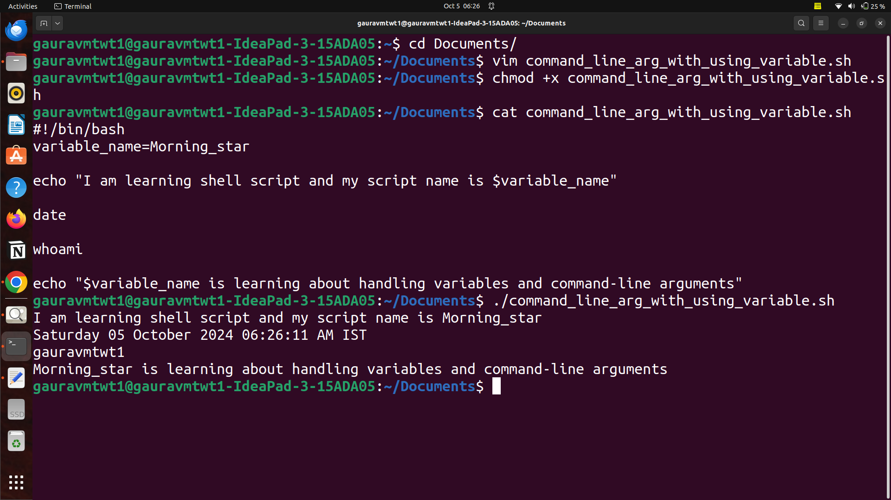

### Solution:

If we specify the script variable name in the command line when a new mission is launched, it simplifies the process. Here's how you can access the mission name through the command line and use it in the script:

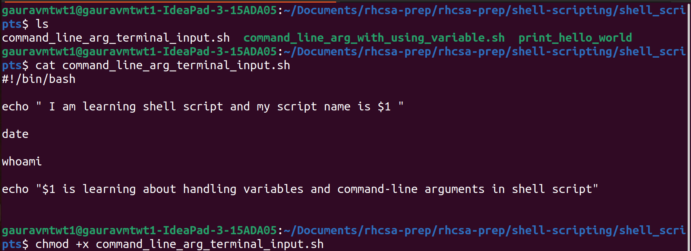

### Command Line Argument:

- `$0`: Represents the script name.
- `$1`: Represents the first command line argument 

Here's an example of using command line arguments in a script:

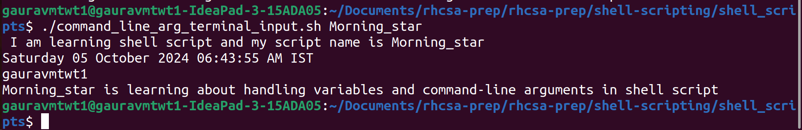

> **Note:** When someone else reviews the script in the future, the second part in the picture above may be hard to understand. Hence, it is recommended to use the format from the first picture for better clarity.

---

### Best Practices:

1. **Make your script reusable**: Design your script to handle various inputs and conditions without needing manual updates.
2. **Avoid hardcoding values**: The script should not require editing before running.
3. **Use command line arguments**: Pass inputs like mission name using command line arguments to make the script flexible and easy to use.

## Shell Scripting: `read` Command and Command-line Arguments

In shell scripting, you can pass inputs in two primary ways:
1. **Command-line arguments**: e.g., `$1`, `$2`, etc.
2. **Using `read` command**: To prompt users for input during execution.

### Using read Command for Input:

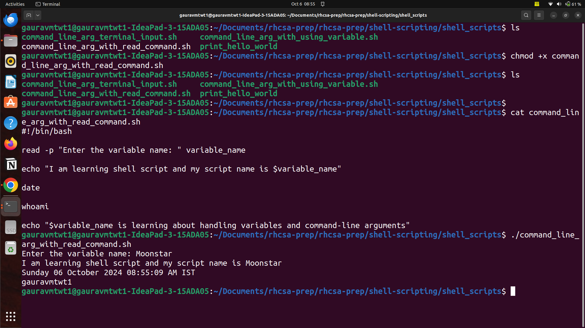

# 4. Arithmetic Operations

This document covers various methods of performing arithmetic operations in shell scripting.

## Methods of Performing Arithmetic Operations

### a. Using `expr` Command
- The `expr` command is a standard utility for evaluating expressions.

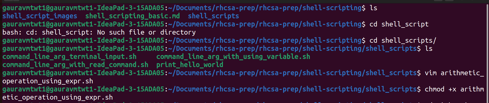

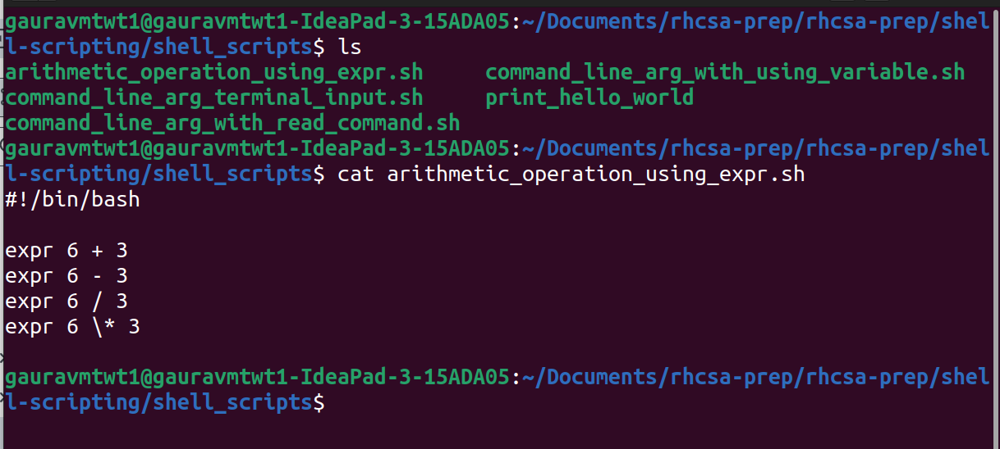

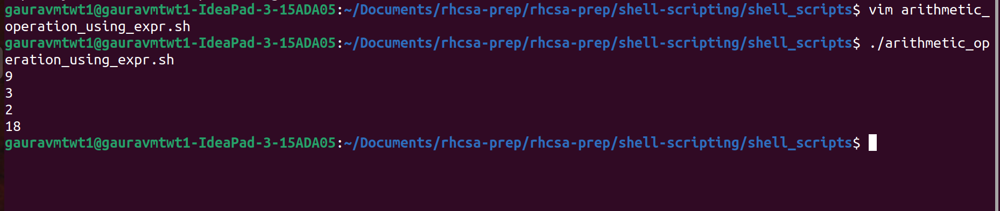

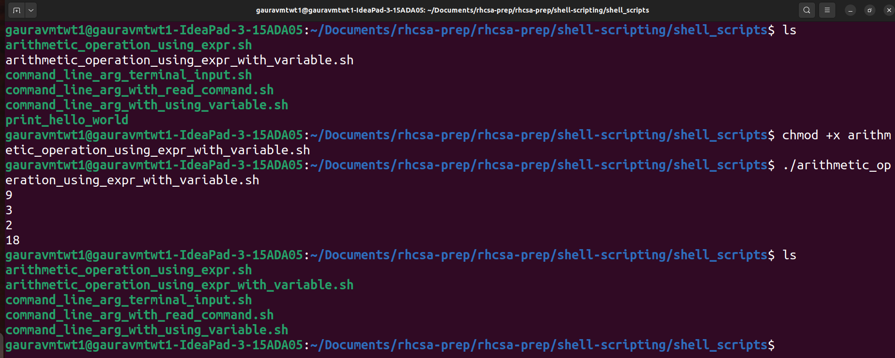

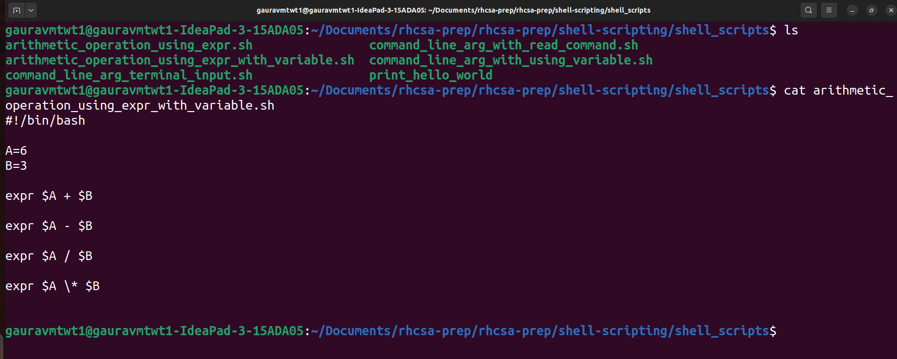


### b. Using Double Parentheses `(( ))`
- This method allows arithmetic evaluation similar to C programming.
- You can assign the result to a variable or use `echo` to print it.
- Example:
    ```bash
    A=20
    B=10
    echo "Sum is $((A + B))"
    ```
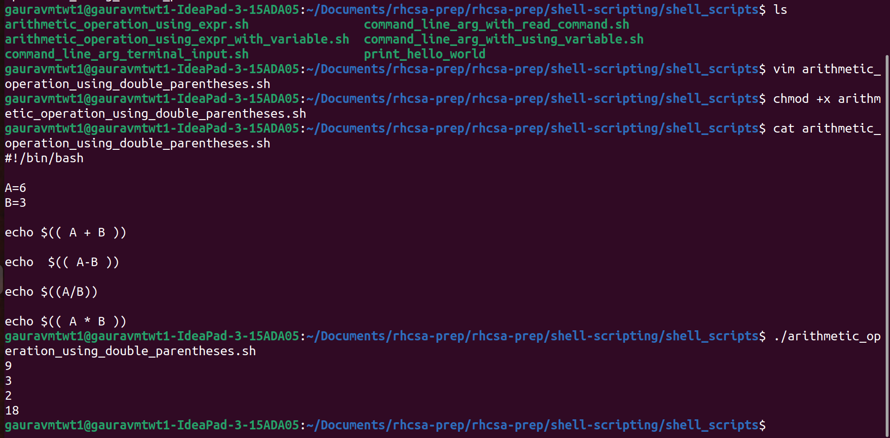

- **Important Notes:**
  - No dollar symbol for variables within `(( ))`.
  - No space is needed between operators and variables.
  - For multiplication, no need to escape the `*`.

### c. Using `bc` Utility for Floating-Point Arithmetic
- The `bc` utility functions as a basic calculator in Linux and can handle floating-point numbers.
- Use `-l` option to enable floating-point calculations.
- Example:
    ```bash
    echo "10/3" | bc -l
    ```
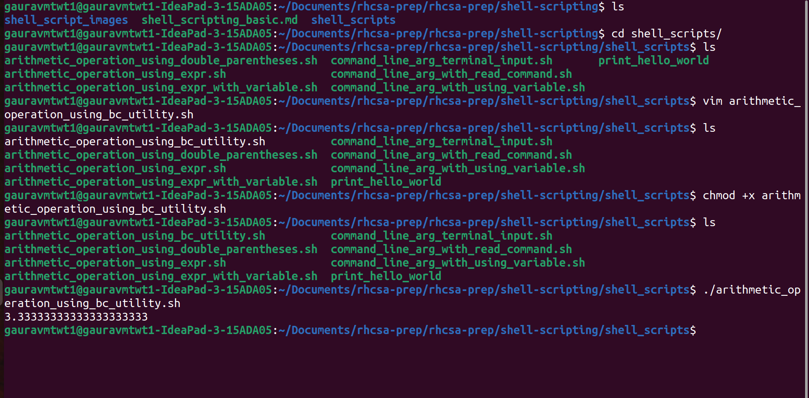


## 5. Conditional Logic Explanation

Using conditional logic, we can define actions based on specific conditions. In this case, we are using the `if` statement. If a condition is met, the corresponding action is executed.

### IF Statement Example:

```bash
if [ condition ]
then
   # code to execute
fi
```
If the condition is true, the code inside the block will be executed.

### Else and Elif Statements

- **Elif**: If the initial condition is false, the script will check the `elif` condition. If it's true, it will execute that block.
- **Else**: If none of the conditions match, the code inside the `else` block will be executed.

```bash
if [ condition1 ]
then
   # code to execute if condition1 is true
elif [ condition2 ]
then
   # code to execute if condition2 is true
else
   # code to execute if none of the above conditions are true
fi
```

## Comparison Statements

A comparison statement should be placed inside square brackets (`[]`) with spaces between the brackets and your statement. Here are a few common comparison operators used in shell scripting:

- `-eq`: equal to
- `-ne`: not equal to
- `-gt`: greater than
- `-lt`: less than
- `-ge`: greater than or equal to
- `-le`: less than or equal to

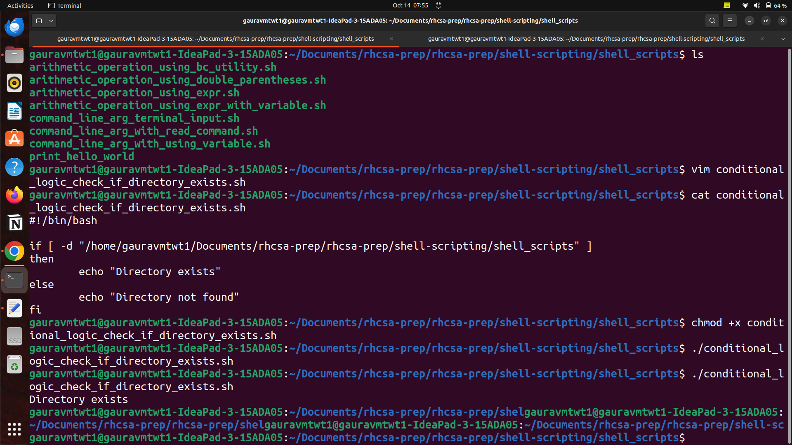

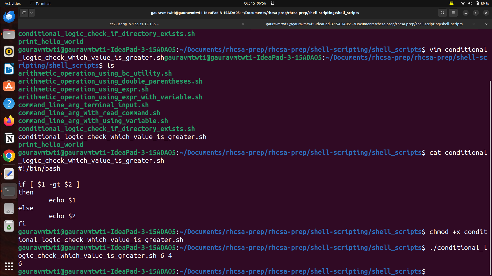


# Loops in Shell Scripting: `for` Loop

## 1. Introduction to Loops
- A loop allows executing a block of code multiple times.
- The `for` loop is particularly useful for iterating over a list of items.

## 2. Syntax of the `for` Loop
```bash
for variable in list
do
   command1
   command2
   ...
done

```
- variable: Holds the value of the current item in the list.
- list: Can be a series of strings or results of a command.
- do: Begins the loop block.
- done: Ends the loop block.

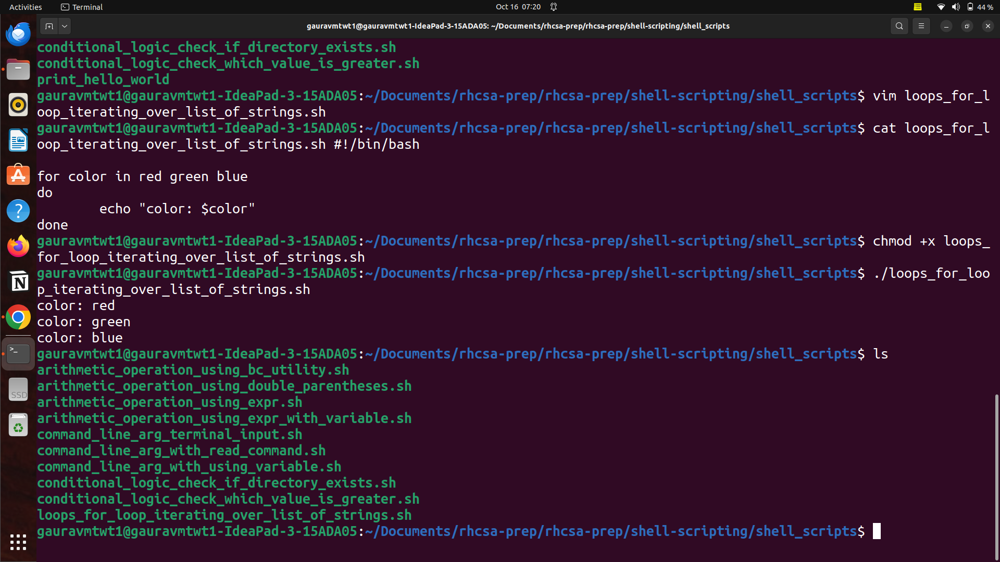

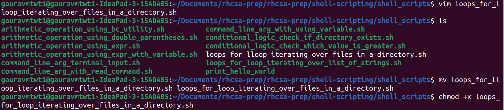

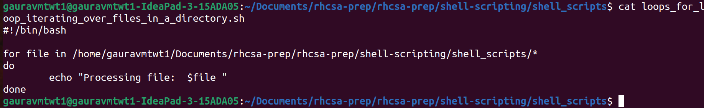

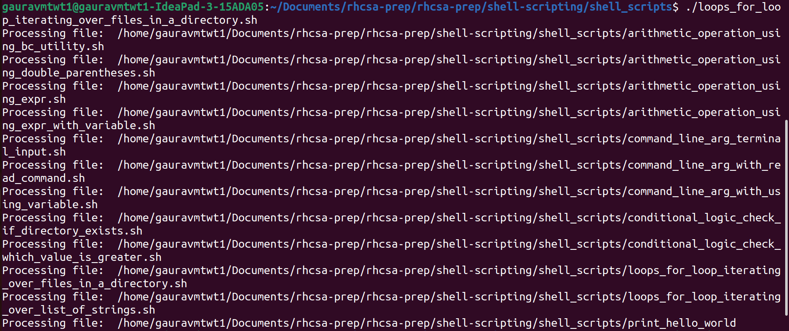


## Best Practices
- Always ensure your loop termination condition is well-defined.
- Be cautious with large lists or infinite loops to avoid performance bottlenecks.

# Loops in Shell Scripting: `While` Loop
	
- The while loop in shell scripting repeatedly executes a set of commands as long as a specified condition is true.

```bash
while [ condition ]
do
   # commands to be executed
done
```

## Key Points:
- Condition: The loop will run as long as the condition evaluates to true.
- Commands: The block of code inside the do...done section will be executed in each iteration.
- Condition Evaluation: The condition is evaluated before each iteration. If it becomes false, the loop terminates.

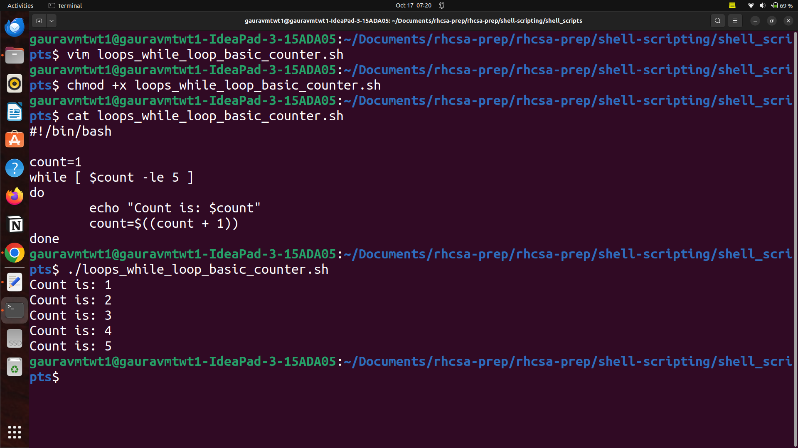

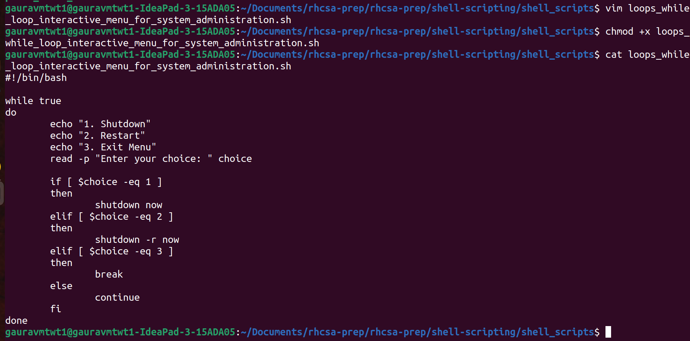

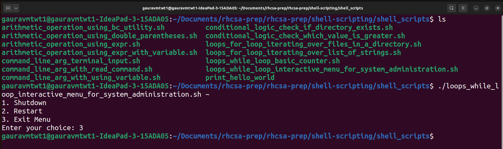


# Loops in Shell Scripting: Case Statements

**case statements** in shell scripting. The **case** construct is used for pattern matching and simplifies multiple conditional checks, offering a cleaner alternative to multiple `if-elif` conditions.

## Key Concepts:

1. **Syntax**:
The case statement follows a simple structure:
```bash
   case $variable in
     pattern1) 
       # commands ;;
     pattern2) 
       # commands ;;
     *) 
       # default ;;
   esac
```
## Usage Scenarios:

- Choosing between different operations based on user input.
- Automating tasks like starting services, file handling, or responding to arguments in a script.

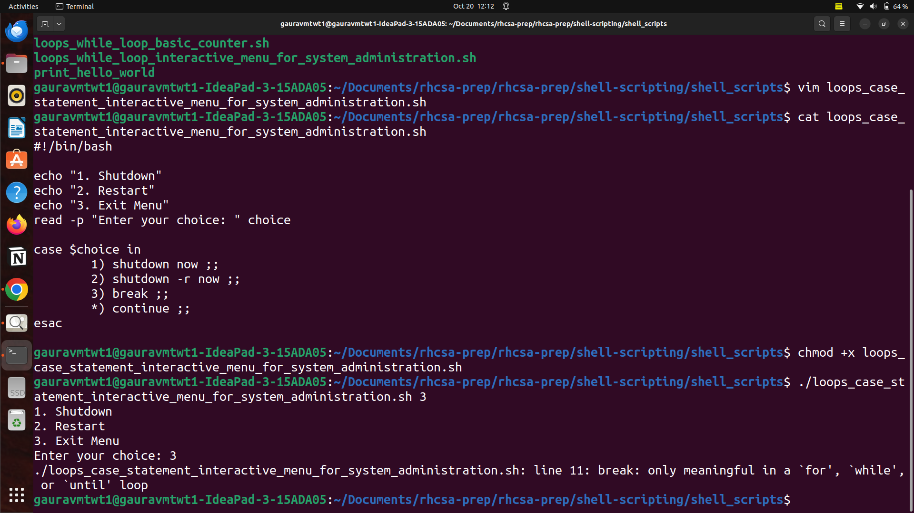

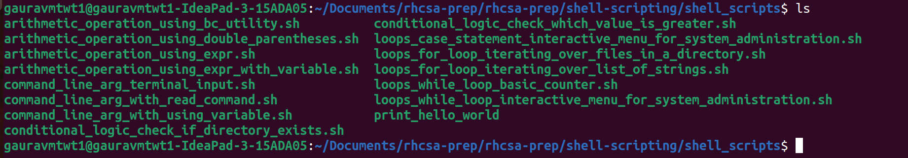

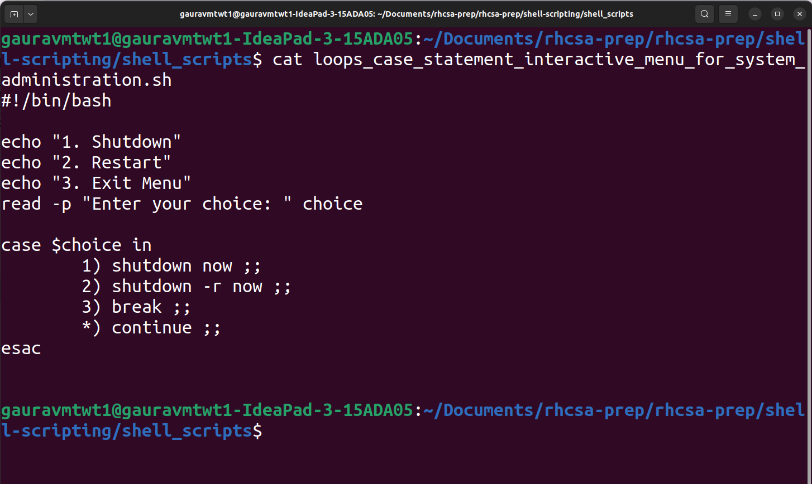


# **Shebang (`#!`) in Shell Scripting**

The **shebang** is the first line in a shell script, written as `#!/path/to/interpreter`, which tells the operating system which interpreter should be used to execute the script. It begins with `#!` followed by the path to the shell or interpreter.

## Purpose
It defines the script's interpreter (e.g., Bash, Python, Perl) to ensure the script is executed in the correct environment.

## Example
```bash
#!/bin/bash
echo "Hello, World!"
```

## Common Shebangs
- #!/bin/bash - Uses the Bash shell.
- #!/bin/sh - Uses the default system shell.
- #!/usr/bin/env python3 - Uses Python 3 interpreter.

## Without Shebang
If omitted, the script will run in the current shell, which might lead to inconsistencies if a different shell is expected.

## Portability
Using #!/usr/bin/env <interpreter> is considered more portable as it searches the environment for the specified interpreter.

# Exit Codes in Shell Scripting

An **exit code** (also called return code) is a number returned by a script or command when it finishes execution. It indicates whether the script or command ran successfully or failed.

### Exit Code `0`
This generally means **success**. When a command or script finishes without any issues, it returns an exit code of `0`.

### Exit Code `> 0`
Any exit code greater than `0` indicates **failure**. The number helps specify the type of error, such as `1` for general errors or `127` for command not found errors.

## Checking Exit Codes

- To check the exit code of the last executed command, use:

```bash
echo $?
```
This will display the exit code.

### Best Practice
Always return appropriate exit codes in your script to help track success or failure.

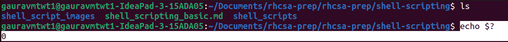

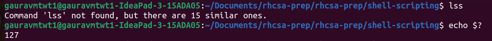


# Shell Script Functions

## Definition and Purpose:
- A function in a shell script is a reusable block of code that can be invoked multiple times within the script.
- Functions help modularize scripts, making the code cleaner and easier to manage.

## Function Syntax:
- Functions are defined at the beginning of the script.
- A typical function structure:
```bash
    function_name() {
       # function body
    }
```
- After defining a function, you can call it from the main section of the script by simply using its name.

## Function Parameters:
- Functions can accept arguments (parameters). These parameters are accessed using `$1`, `$2`, etc., where `$1` refers to the first argument passed when calling the function.
- Example:
```bash
    mission_name() {
       echo "The mission name is $1"
    }
```
- Calling the function: `mission_name "Apollo"`

## Calling a Function:
- When the script is executed, the function can be invoked multiple times with different arguments, depending on the requirements.
- The script flows sequentially from top to bottom, executing the function when it encounters the function call.

## Error Handling:
- If a function is called before it is defined, the script will throw a "command not found" error.
- It’s recommended to define functions at the top before calling them in the main script.

## Return Statement:
- The `return` statement is used within a function to return an exit status or value.
- Unlike `exit`, which terminates the entire script, `return` only exits the function, allowing the script to continue running.
- Using `return` is preferred for handling errors inside functions to avoid premature termination of the script.

## Exit Codes:
- Functions can return specific exit codes using `return <code>`, which can be checked in the main script to determine if the function executed successfully.

## Best Practices:
- Ensure functions are defined before they are called.
- Use `return` instead of `exit` within functions to prevent the script from stopping unexpectedly.
- Pass necessary parameters to functions for flexible and reusable code.

